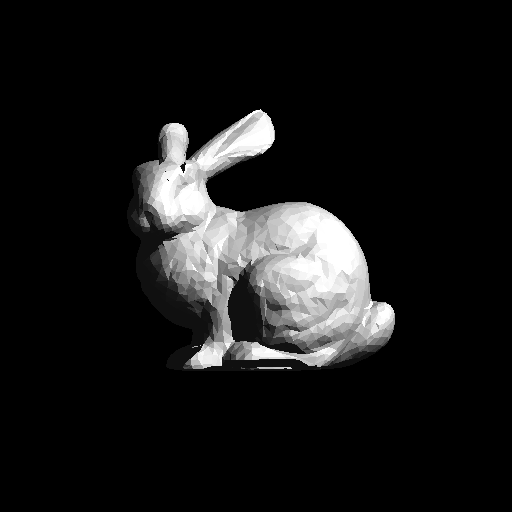
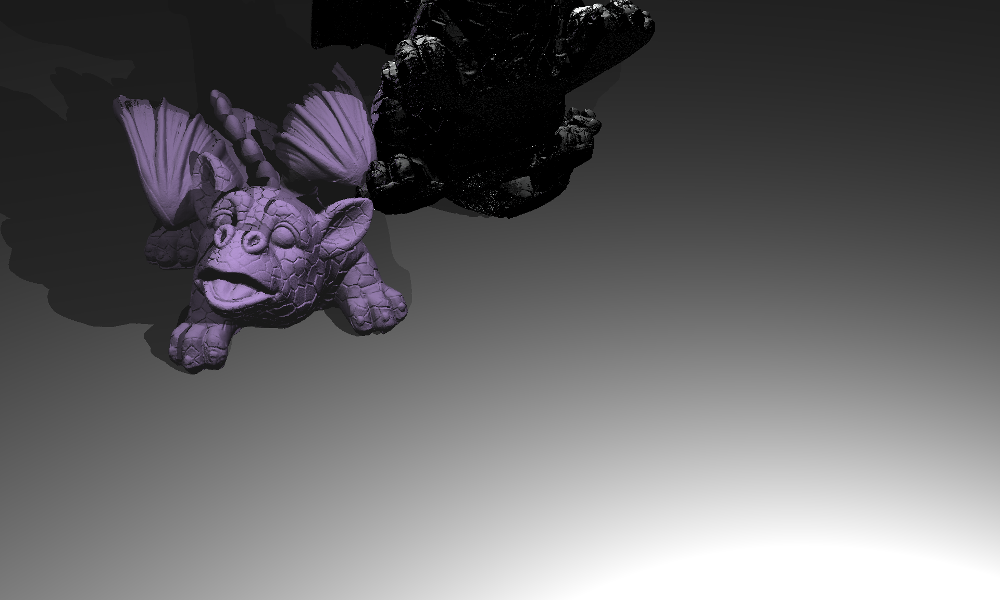
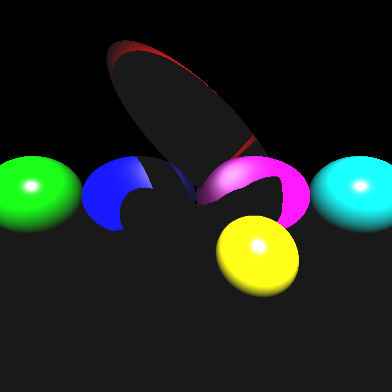
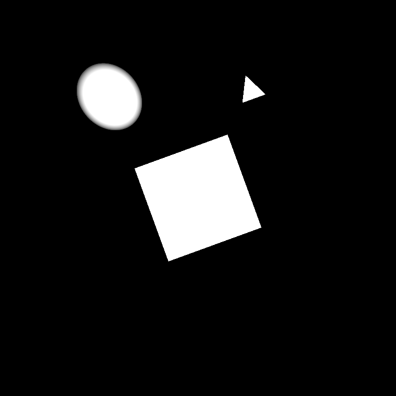
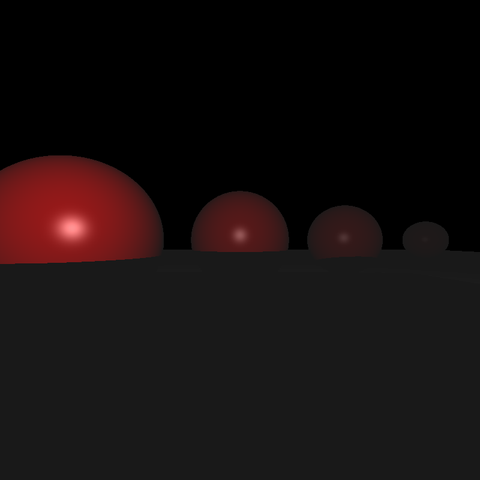

# CENG795-HW2: Raytracing with BVH and Transformations

- [Implementation](#implementation)
  - [Bounding Volume Hierarchy](#bounding-volume-hierarchy)
  - [Instancing](#instancing)
  - [Transformations](#transformations)
- [Results](#results)
- [Performance](#performance)
- [Conclusion](#conclusion)


**WARNING**: This blog post discusses not only my submission, but also a few fixes I have done while writing the post. Whenever such a deviation from the submission occurs, it is denoted as **\[NYI\]**.

Hello everybody. Welcome to my second blog post about the first homework of the course CENG795, Advanced Ray Tracing.

I have developed a simple raytracer in the previous homework, which worked pretty well. However, it lacked two fundamental features: an acceleration structure and support for transformations. For the homework, we also had to implement instancing, which works pretty well with transformations.

However, this time, I did not have a total success.

## Implementation

### Bounding Volume Hierarchy

The first thing I did was to implement an acceleration structure. After having more than 4 hours of rendering time in some scenes (`other_dragon` to be exact), I _needed_ that structure.

There is two kinds of acceleration structures one can use in a scene: Top Level Acceleration Structures (TLAS) and Bottom Level Acceleration Structures (BLAS). I only implemented BLAS since transformations would make TLAS worse: transforming a bounding box without transforming every vertex will result in a non-tight bounding box if the transformation includes rotations. However, there is no such issue for BLAS due to the fact that BLAS is constructed _inside_ the local space of the mesh. My implementation can easily be extended to TLAS, but it currently does not support it.

I added a jagged array of BVH nodes to the scene. Each array in `mesh_bvh` contain the full BVH tree of the mesh at the same index.

```cpp
std::vector<std::vector<bvh_node_children_t>> mesh_bvh;
```

Why not an array of nodes (`bvh_node_t` in my implementation) but an array of _children_? The reason is to simplify the creation of BVH. A `bvh_node_children_t` is actually a simple array of 4 BVH nodes. I planned for some sort of a SIMD traversal for which I would apply bounding box-ray intersection algorithm to 4 nodes in parallel. Since I have not even succeed on implementing the homework, I had to discard that plan. However, I wanted to make this optimization possible in an easy way. This is why my BVH is not a binary tree but a quad tree. The children of a node are laid sequentially in the memory as `bvh_node_children_t`. This also meant that I needed a single integer per node to denote children, this index will be used to index `std::vector<bvh_node_children_t>` part. This approach also had another advantage of improved cache efficiency. If a BVH node is hit, all of its children must be visited. Laying the children sequentially can improve the performance, especially when a child is discarded quickly before populating the cache with its own children.

One of the problems with this approach is indexing. Now, there are two indices denoting a BVH node: the index in the children array array and the index in the children array.  This can be solved by using a bitfield:

**\[NYI\]**

```cpp
struct bvh_index_t {
   size_t array_index: 62;
   size_t child_index: 2;
};
```

I did not use this approach. Well, this actually came to my mind while writing this post. If I have time, I will probably change my implementation to use this trick. This is not a crucial trick tho, since BVH creation is not (at least should not) be a bottleneck and this improvement will not be a drastic one. It is sexy nonetheless.

For BVH creation, I had slice of the primitives which I divided using two algorithms: the simple median one and a complete tree one.

Of course the median one does not work as it is since my nodes had 4 children. However, 25th, 50th and 75th percentiles of the primitive array can be used for partition. I divided (`n`) and modulo'd (`m`) The size of the array slice. For each child, the start of the child's slice is the end of the previous child's slice (at the first iteration, the end of the slice of the previous child is the start of the parent's slice). This ensures there is no missed primitive. The end of the child's slice is the start of it + `n` + `(m < i)` where `i` is the index of the child we are processing. I actually have a `wtf` comment at the end of this line, but it works to make it so that the partitions lean left. If there is any remaining primitive after dividing by 4, the parititons are increased by 1 starting from the leftmost child.

For the other implementation, I needed to find the largest power of 4 smaller than the size of the slice, not including the size itself.

```cpp
static size_t get_previous_power_of_4(size_t n) {
    return std::pow(4.0, std::floor(std::log2(n - 1) / 2.0));
}
```

This achieves what I needed. It is somewhat slow since `log2` is not the fastest thing a processor can do. It can be improved by using bit hacks; however, I did not use them since I needed a working code first and I sometimes cannot be sure about the correctness of bit hacks, especially ones I create myself. After calling this function with the size of the slice, I just use this as the size of the slice of each child. However, I segfaulted when I used this code. A quick debugging session revealed that I accessed out-of-bounds in the primitive array.

Let's have 60 primitives. The `get_previous_power_of_4` function will return `16`, which is the size of each child slice. The half-open intervals then would be:

```
0-16, 16-32, 32-48, 48-64
```

As you can see, the last slice accesses 60, 61, 62 and 63, all of which are out-of-bounds. The fix was simple: clamping the end to the size of the array. This also works when the right slice is empty, e.g. 40 primitives:

```
0-16, 16-32, 32-40, 40-40
```

Afterwards, I called the construction function recursively for each children and after returning, set the parent's bounding box accordingly.

The BVH intersection was simple, but I wanted to support a possible TLAS implementation. After thinking for some time, I remembered what I did in my internship. I used callbacks for events in order to separate the GUI and the application logic in my internship and I realized that this can easily be applied in this case. An intersection is an event after all, not different than a key press!

If the BVH results in a negative index, which means that it is a leaf node and the absolute value of this index denotes something for the callback. The absolute value of the index, along with the ray and the `t_candidate` reference, will be passed to a callback. This way, the callback can do any intersection it wants. For BLAS, the callback simply delegated the execution to the triangle intersection function. As I said, I did not implement TLAS but it would simply be a callback that delegates the execution to the BVH intersection with the root at `mesh_bvh[index]` where the `index` is the index passed to the callback.

When I tried to run with `bunny`, I saw that the geometry looked like it was frontface-culled.


After some painful debugging, I came accross that this line was the culprit:

```cpp
return intersect(bvh, ch, 0, t_out, index, hit_callback) or
       intersect(bvh, ch, 1, t_out, index, hit_callback) or
       intersect(bvh, ch, 2, t_out, index, hit_callback) or
       intersect(bvh, ch, 3, t_out, index, hit_callback);
```

If the first intersection succeeds, due to the short-circuit nature of `or`, the remaining children are not tested at all! However, if backface culling is enabled (which I managed to implement using the boolean template approach I mentioned in the HW1 blog post), the result is less severe:



After fixing the line so that each intersection is done and the resulting booleans are saved to variables, which are `or`d to get the return value, the result was correct (same as the one from HW1). However, the time was about `2x` of the non-BVH version! Houston, we have a problem. After another turn of painful debugging session, I realized that no matter what, the `aabb_intersection` function returned `true`. Since I took the intersection code from [here](https://tavianator.com/2022/ray_box_boundary.html) and it was pretty much magic, I could not debug it. I fixed the problem when I came across [this](https://gamedev.stackexchange.com/a/18459) AABB-ray intersection implementation, which is pretty much the same as the previous one. But for some reason, this time it worked.

And now, a successful bunny in `136.5` milliseconds? BVH was a great success!

Now, I can construct BVH for `other_dragon` in `1.62426` seconds and render the image in `0.904226` seconds. If I divide my result from HW1 (`15122.9` seconds) by the total time the program needs to do all the work with BVH (measured using `Measure-Command` cmdlet of PowerShell), I got a `5815.5x` improvement! This is more than three orders of magnitude! Of course not all scenes had improvements that dramatic. For instance, `bunny` by comparison improved by about `27x`, which is still more than one order of magnitude. Still impressive!

### Instancing

Before transformations, I wanted to implement instancing since I thought that it would be easier. I thought about the architecture of the program in the toilet cabins (the best place on the Earth to solve engineering problems, for some reason) and decided to replace rendering of the meshes with rendering of instances of meshes, with a `<Mesh>` element also corresponding to an instance.

```cpp
struct instance_t {
    glm::mat4 transform = glm::mat4(1.0f);
    glm::mat4 inverse_transform = glm::mat4(1.0f);
    size_t material;
    size_t index;
};
```

However, for some reason, I thought that spheres and singular triangles would also have instancing, so changed all of three primitive types to use `instance_t`. I did not have time to fix it, but I will probably fix in the next homework. This does not cause any problem in outputs but simply decreases the performance a bit. On the other hand, it has a nice side effect: the triangles in my meshes each had materials since I used the same type for singular triangle primitives. When I extracted the material from triangles to instances, this small memory inefficiency was also solved. Yet I need a better solution, probably by using two different kinds of triangles, one for triangle primitives and one for triangles in meshes.

The next thing was modifying the parser. First, I pushed the transformations. The transformations themselves were discarded after parsing since the `instance_t` struct has enough information. I used `stringstream` to parse transformations used in primitives and `glm`'s `translate`, `rotate` and `scale` functions to create transformation matrices for instances. I simply multiplied the transformation from left.

After this, I took the base mesh, multiplied its transform with the new instance's calculated transform and pre-calculated the inverse of this. This however should have been overridable by `resetTransform` attribute, but I forgot to do it since it was not needed for my first tests, so this check is not in my submission. Adding it was simple tho: **\[NYI\]** a single line of `if` and a matching closing brace.

### Transformations

Transformation should be easy, right? I can just multiply the inverse of the transformation of the mesh with the ray and call it a day, right? Sadly, no. I was thinking that the transformation implementation would be like "Let's go, in and out 20 minutes adventure" but it was the opposite. Honestly, I would prefer implementing BVH if I could have implemented only one.

The current architecture was suitable to implement transformations. The `ray_cast` (which takes a ray and finds the closest intersection) method of the `scene` was modified so that it iterated over the instances instead of meshes/triangles/spheres. This meant that at each iteration, I had the model transformation. To utilize it, I created a `ray::transform` method, which takes a transformation matrix and applies it to the ray. The code was simple:

```cpp
rt::ray rt::ray::transform(glm::mat4 transformation) const {
    const auto start = origin;
    const auto end = apply(1.0f);
    const auto tstart = transformation * glm::vec4(start, 1.0f);
    const auto tend = transformation * glm::vec4(end, 1.0f);
    return ray{.origin = tstart, .direction = glm::normalize(tend - tstart)};
}
```

The code is pretty self-explanatory: it applies the ray to get the point with distance `1` from the origin, which becomes our endpoint. This creates a line segment with two points. In the lecture of 2024-10-22, our instructor had said that a vector is difference between two points. I applied this principle by transforming two points, whose difference is the direction of the ray, and it did not work, which I realized while writing the blog post. However, at the moment, I have not fixed it totally. **\[NYI\]** Simply multiplying the transformation matrix from the left with the direction vector (with `w` component being `0.0`) resulted in better results (and made `grass_desert` and `metal_glass_plates` work barring some transformation problems) but some other cases like `spheres` are still not working. Nonetheless, my submission uses the code above to transform a ray.

After this, when the usual ray-intersection algorithms are applied, the resulting `t` is actually in local space. I fixed it using this:

```cpp
t_candidate = glm::length(
                glm::vec3(tri.transform * glm::vec4(hit_point, 1.0f)) - r.origin
            );
```

where `hit_point` is calculated using t from the local space. I am not sure whether this has a problem, but it works nice with my NYI fixes, so I assume that this part was correct.

The last thing I added was support for transformation matrices in shading. I passed the transformation matrix and its inverse and used it to calculate the the starting point of the shadow/reflection/refraction ray. The problem probably was lack of conversion of the normal from local to world space when shading.

## Results











Only simple_transform and marching_dragons cases work well (marching_dragons has some intersection problems causing holes).

## Performance

Some of the instanced and/or transformed cases:

| Testcase           | Initialization Time | Rendering Time |
| ------------------ | ------------------- | -------------- |
| dragon_metal       | 1.66781             | 3.34593        |
| ellipsoids         | 0.0009215           | 0.127835       |
| marching_dragons   | 0.642299            | 1.49556        |
| metal_glass_plates | 0.0009182           | 1.4536         |
| simple_transform   | 0.0005905           | 0.0972494      |
| spheres            | 0.0006594           | 0.115266       |
| grass_desert       | 0.004157            | 9.4637         |
| two_berserkers     | 0.13364             | 0.29851        |

For comparison with the previous homework, here is the table for the cases I tested in HW1:

| Testcase             | Initialization Time (Complete Tree BVH) | Initialization Time (Median BVH) | Rendering Time (Complete Tree BVH) | Rendering Time (Median BVH) |
| -------------------- | --------------------------------------- | -------------------------------- | ---------------------------------- | --------------------------- |
| Berserker            | 0.019156044                             | 0.019131013                      | 0.335249032                        | 0.321981069                 |
| Bunny                | 0.026116776                             | 0.02602214                       | 0.076112225                        | 0.072042758                 |
| Car                  | 0.036106005                             | 0.036436071                      | 0.515020124                        | 0.473704802                 |
| Car Front            | 0.036106005                             | 0.036436071                      | 0.51656498                         | 0.476866441                 |
| Cornellbox           | 0.000743204                             | 0.000748143                      | 0.145353368                        | 0.14518485                  |
| Cornellbox Recursive | 0.000798003                             | 0.000804106                      | 0.235976484                        | 0.234756606                 |
| Low Poly             | 0.032911273                             | 0.032460691                      | 0.83449588                         | 0.816300713                 |
| Other Dragon         | 1.641374146                             | 1.568181485                      | 0.914947284                        | 0.961579617                 |
| Science Tree Glass   | 0.012107489                             | 0.012102265                      | 0.804868588                        | 0.821330206                 |
| Spheres              | 0.000773866                             | 0.000767542                      | 0.134561967                        | 0.130511143                 |
| Spheres Mirror       | 0.00081141                              | 0.000775633                      | 0.152832844                        | 0.148085395                 |
| Tower                | 0.023215116                             | 0.023918437                      | 0.901310673                        | 0.988822282                 |
| Two Spheres          | 0.000517918                             | 0.000508618                      | 0.08861407                         | 0.089882233                 |
| Windmill             | 0.044253173                             | 0.044485013                      | 0.782553569                        | 0.818833286                 |

Each of the cases actually ran for 10 times and the result is calculated as the geometric mean of these results. Car and Car Front have same initialization times since they actually render the same scene.

For visualization purposes, I also draw bar charts for the previous table. First graph shows each scene, phase and BVH split algorithm separately. Second graph stacks initialization and rendering times of each algorithm so that the total times can easily be compared. Both plots are drawn using matplotlib.


## Conclusion

The homework was, well, not a success. My half-baked submission is so bad that I have and will not try to render the video examples. However, I have at least some idea to fix these problems, and also an extra week. I also learnt once again that looking down to any kind of work is harmful. Having unrelated problems to the homeworks also does not help. Nevertheless, I am glad that I tried to do this homework, the insights of these homeworks are simply great.

---
{
  "author": "Erencan Ceyhan",
  "lang": "en",
  "tags": ["C++", "Programlama", "Teknoloji", "Gönderi", "Ödev", "Işın İzleme"]
}
---

---
{
   "date": "[2024](/gönderiler/2024)-[11](/gönderiler/2024/11)-09 21:57:50+03:00"
}
---

