# CENG795-HW4: Raytracing with Textures

- [Reimplementation (Failure)](#reimplementation-failure)
- [Implementation](#implementation)
  - [Diffuse and Specular Textures](#diffuse-and-specular-textures)
  - [Noise and Checkerboard](#noise-and-checkerboard)
  - [Normal and Bump Mapping](#normal-and-bump-mapping)
- [Results](#results)
- [Performance](#performance)
  - [Compiler Benchmark](#compiler-benchmark)
  - [Texture Benchmark](#texture-benchmark)
- [Conclusion](#conclusion)

Welcome again to my blog post about yet another CENG795 homework, minasan! I think my recovery from my failure of the HW2 is pretty much done, now I implement the homeworks on time, and even, sometime before the deadline. Actually, in this homework, I managed to finish the homework about 3 days early except a small fix to sphere tangent/bitangent calculation, while using almost half of the time (about 1 week) to something I did in vain.

## Reimplementation (Failure)

As I said in the previous paragraph, my first week was doing something that I did not use at all: reimplementing the whole raytracer from scratch. I had actually been thinking reimplementation since HW2; however, unfortunately, things did not go according to my plan and I had to postpone any consideration of reimplementation. Yet in the implementation of HW4, I actually had time to waste in reimplementation. There were two reasons of why I wanted reimplementation: using a nicer language (since C++ is pretty bad in terms of programming language design, and it also has abysmal compilation times) and fixing a few design choices I did that started to get in my way. Since performance is top priority in raytracing, any pure interpreted language like Python (which has JIT compiler PyPy but its performance is also not that bright) is out of question. Since Rust and Haskell had been used in this course before, I did not want to use them since I wanted to use a "new" language, a language that has not been used in this course. Losing Rust to this silly thought has been pretty bad for the choice of language. The language also should be something I am at least a bit familiar with. This also filtered Java and OcaML. The current languages were C, C#, Lua (with LuaJIT) and JS/TS (on browser). Since I would probably debug segfaults more than my raytracer, I eliminated C. All of these remaining languages are pretty nice ones, so I started the reimplementation. I also thought about the nice-to-haves in those languages, and Lua was better than C# due to having [LÖVE](https://love2d.org), which can be run on both desktop and mobile devices, and provides a nice layer on top of SDL, and OpenGL to some extent. It also comes with LuaJIT as default. However, JS/TS is even better since everybody and their brother/uncle/mother has a browser, which makes the distribution (not the HW3) much less of a hassle. So, I started to reimplement the raytracer in TS, but after implementing some parts, I failed to use the modules (since JS has the worst module system in the world, even worse than C). At that point, almost half of the first week had passed, so I panicked and dropped my first reimplementation reason: a nicer language.

Afterwards, I dumped the TS implementation and started the reimplementation on C++. I did this so that I could share code with my existing implementation, I was pretty fine with the ray creation or ray-triangle intersection codes after all. However, as I rewrote the parser, I realized that in that pace, I would miss the deadline for HW4, since it took a whole day to reimplement the parser, _with a few features missing_. The code itself also became mostly non-interoperable with my previous ray-tracer since I changed most data structures. For example, the materials were classes with `virtual` methods instead of `std::variant`s since C++ has one of the worst sum-type support while the `virtual` is one of the best things in C++. Most of the data structures also held references to the data they need (e.g. meshes held references to the vertex array, since the mesh data is in indices instead of raw vectors). This made interoperation with my previous code pretty much impossible except rewriting a huge part of the older one, which just meant almost a total rewrite, for which I did not have time. At that point, the first week already passed and I was yet to start the HW4, while also being somewhat tired of the raytracer. Erencan is Done For![^1]

As the second week started, I just discarded the whole adventure of reimplementation and started to refactor some parts of my existing raytracer instead. Since HW4 does not have too much need to fiddle with the materials, I just postponed material refactor to another time and refactored the build system, folder structure and the parser. Since the parser cosists of repeated code like this:

```cpp
// Get ShadowRayEpsilon
element = root->FirstChildElement("ShadowRayEpsilon");
if (element) {
    stream << element->GetText() << std::endl;
} else {
    stream << "0.001" << std::endl;
}
stream >> ret.shadow_ray_epsilon;
```

I wrapped up this as a templated function:

```cpp
template <typename T>
static T get(const tinyxml2::XMLElement* element, std::stringstream& ss) {
    if (element == nullptr) {
        throw std::runtime_error("Error: element is null");
    }
    auto ret = T();
    ss << element->GetText();
    ss >> ret;
    ss.clear();
    return ret;
}
```

Of course `glm::vec`s cannot be read from a stream, so I defined the `operator>>`s for them, which just read from the stream to the fields of the vectors. I also created an overload of `get<T>`:

```cpp
template <typename T>
static T get(const tinyxml2::XMLElement* element, std::stringstream& ss, const T& default_value) {
    if (element == nullptr) {
        return default_value;
    }
    auto ret = T();
    ss << element->GetText();
    ss >> ret;
    ss.clear();
    return ret;
}
```

This returns the `default_value` instead of throwing an error when the element is not found, which is pretty useful for optional fields, such as `BackgroundColor`, which I assume to be $[0, 0, 0]$ as default.

Rewriting most of the parser to use this was pretty easy, I just removed the old code (as in the example I gave for `ShadowRayEpsilon`) and replaced with a `get<T>` call with suitable type as the template parameter. However, there was a small problem, that some fields (like `ImageName` for `Camera` and `Transformations` for `Mesh`/`Triangle`/`Sphere`) needs the whole text of the element, and `stream >> str` where `str` is an `std::string` reads until the first whitespace, which is not usable since filenames may have spaces, and transformations definitely have spaces separating them. Hence, I created a small full template specialization:

```cpp
template <>
std::string get<std::string>(const tinyxml2::XMLElement* element, std::stringstream&) {
    if (element == nullptr) {
        throw std::runtime_error("Error: element is null");
    }
    return element->GetText();
}
```

The `stringstream` is not needed since the returned value is the whole text itself, which is why I did not give name for the second parameter. However, it is needed to be there since it is not an overload but a specialization.

This rewrite decreased the number of lines from 580 to 462 while also fixing a small bug that had been there in my implementation since HW1: some cases have the image plane distance as the fifth value in the `NearPlane` field, which broke the old code since it did not clear the `stringstream` after reading `NearPlane`, which offsets every value after it.

As I said, I also refactored the folder tree and changed the build system. Since HW1, I used a modified version of my [generic Makefile](https://erencanc.pages.dev/files/GenericMakefile/Makefile), which handles recursive source tree pretty well. However, mixing release and debug builds was horrible, since both of them put their object files to the same place. This meant that if I compile the program with debug mode, change one file and recompile with release mode, the program I get would be a chimera of release and debug builds, with only the changed file's corresponding object file being in release mode. In previous homeworks, whenever I needed to debug using GDB, I needed to recompile everything. After solving the problem, I needed to recompile everything again using release mode to get the output image in a reasonable time (to check the overall image). This development loop was a real headache for me. However, thanks to CMake, I do not and will not have this! I divided the program into some modules (bvh, glm, math, parser, scene, shading, stb and tinyxml), which are compiled on their own and the whole program is linked at the last step, the usual compilation pipeline. I struggled with CMake at first, but the whole compilation pipeline became a breeze after I did it. After a week of HW4 implementation, I can confidently say that this improved my see-debug-fix-see loop substantially. I probably spent half of time per an instance of that loop compared to my generic Makefile. Furthermore, there is a very nice side effect: now I can compile my program on MSVC [for free](assets/For free.mp4)! I mentioned this before but, I did a small benchmark between GCC and MSVC.

I also created a small Lua script to automatize some work, like running a testcase 10 times and taking the geometric mean. It even outputs a Markdown table automatically, so that I can just copy-paste the output of the script to my post!

[Click here](#compiler-benchmark) to get to the benchmark results section, which I did thanks to these conveniences.

## Implementation

Finally, I can start doing the homework! Implementing texture support was actually pretty easy, except for bump mapping.

The first thing I did was to decide on the architecture of the textures. Textures come with three flavors: image, noise and checkerboard. This is perfect for sum-types, but C++ `std::variant` is one of the worst sum-type implementations. Hence, I went with `virtual` methods instead.

There is however a small problem, that a derived class pointer/reference cannot be cast to a base class one _if the base class is not a direct parent of the derived class_. This means that something like this is illegal:

```cpp
class A {};
class B : public A {};
class C : public B {};

int main() {
    auto c = new C();
    A* a = c;
}
```

Actually, this exact code is not illegal, but for some reason, while I was reimplementing the materials, I came across such a problem. This is why the real concrete classes, `ImageTexture`, `NoiseTexture` and `CheckerboardTexture` are actually just child of data (`DImageTexture`, `DNoiseTexture` and `DCheckerboardTexture`) and interface (`ITexture`) classes in my code. However, I do not have a problem with this that much, since this separates the data and the implementation pretty well. `D*Texture` classes (actually `struct`s since I do not use `class` keyword) are pretty much POD structs, which is very nice.

The texture interface, defined in `ITexture` is this:

```cpp
struct ITexture {
    virtual glm::vec3 sample(glm::vec3 tex_coords, float lambda = 0.0f) const = 0;
    virtual DecalMode get_decal_mode() const = 0;
    virtual bool needs_world_coord() const = 0;
    virtual glm::vec2 get_derivative() const = 0;
    virtual float get_bump_factor() const = 0;
    virtual glm::vec3 get_gradient(glm::vec3 position, float factor) const;
};
```

Some of these methods are probably redundant and can be removed, but I just put them there. This is how you get technical debt, Erencan!

As you can see, `get_gradient` is actually not an abstract method. Since getting the gradient for noise/checkerboard needs only sampling, I thought that using the base class not only as an interface but also as something like a mixin (not exactly such but a similar thing). It has an implementation like this:

```cpp
constexpr auto epsilon = 1e-3f;
const auto f = glm::vec3(factor / 3.0f);
const auto h = glm::dot(sample(position), f);
const auto h_x = glm::dot(sample(position + glm::vec3(epsilon, 0, 0)), f);
const auto h_y = glm::dot(sample(position + glm::vec3(0, epsilon, 0)), f);
const auto h_z = glm::dot(sample(position + glm::vec3(0, 0, epsilon)), f);
return glm::vec3((h_x - h) / epsilon, (h_y - h) / epsilon, (h_z - h) / epsilon);
```

This function will be needed in bump mapping for noise/checkerboard, but not yet of course.

Thanks to the `get<T>` functions, parsing the textures was very easy. However, I wanted to improve them a bit and specialized both default and non-default (throwing) ones for `DecalMode`, `InterpolationMode` and `NoiseConversion` (`Normalization` in my code). They are pretty small, consisting of a handful of `if` statements, but they look very nice in the main parser code since I can just call `get<DecalMode>()` etc. The following is `get<InterpolationMode>`:

```cpp
template <>
InterpolationMode get<InterpolationMode>(
    const tinyxml2::XMLElement* element,
    std::stringstream& ss,
    const InterpolationMode& default_value
) {
    if (element == nullptr) {
        return default_value;
    }
    const auto str = get<std::string>(element, ss);
    if (str == "nearest") {
        return InterpolationMode::Nearest;
    } else if (str == "bilinear") {
        return InterpolationMode::Bilinear;
    } else if (str == "trilinear") {
        std::cout << "-- TRILINEAR DETECTED\n";
        return InterpolationMode::Trilinear;
    } else {
        throw std::runtime_error("Unrecognized InterpolationMode: " + str);
    }
}
```

### Diffuse and Specular Textures

After parsing texture coordinates (which reside besides their respective vertex position data), I was ready for textures. However, my first output was this:


The texture looks correct, but the mapping looks wrong. It seems like some coordinates are swapped with each other. In order to test my hypothesis, I showed the UV coordinates instead of shading output (something I almost always do when I start a new OpenGL project), and the result shows the error by itself:


Since I became sure about the error, I started experimenting. Since the coordinates are swapped, I started swapping the barycentric coordinates around with each other. I was using $\alpha$ for UV0, $\beta$ for UV1 and $\gamma$ for UV2. However, after some trial and error, I found out that in my case, the correct order was $\gamma$ for UV0, $\alpha$ for UV1 and $\beta$ for UV2. I don't know the reason of this, but this is how it works. After fixing this, the UV coordinates became correct.


Now, I only needed to test using real texture and voilà!


The only issue remaining for this testcase was that I used nearest neighbor sampling since I had been yet to implement bilinear sampling.

After this, I quickly implemented specular shading texture, which was pretty much the same with diffuse texture. The result was an almost pixel-perfect copy of the reference image.


The next thing I did was implementing bilinear sampling. Implementing it was pretty easy, but I forgot to make the weights $1 - dist$ instead of $dist$, which resulted in a bit weird images:


When I fixed it, the results became pretty much the pixel perfect copies of the reference images:

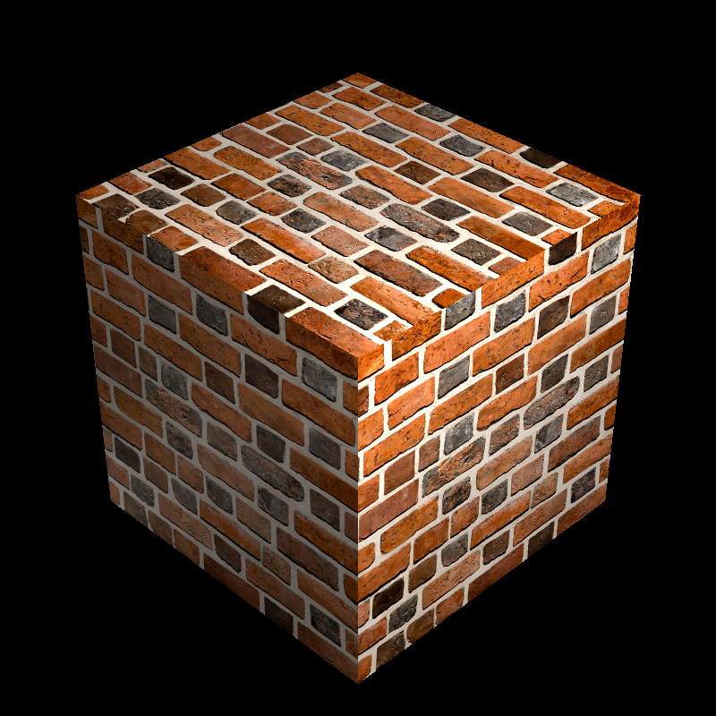

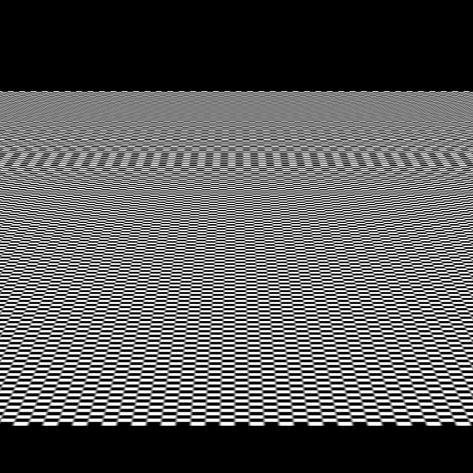

And here is the plane with nearest neighbor sampling for comparison of the aliasing artifacts.


### Noise and Checkerboard

Now, I had pretty much two routes, either first implementing the noise and checkerboard and then implementing normal and bump mapping or vice versa. I went with the former one since I thought it would be easier, and yep, it really was pretty easy.

I searched for a nice Perlin noise implementation in C++ in the internet, since implementing it from scratch was too cumbersome and math-y for me. Unfortunately, I was unsuccessful in my searches; however, the hope was not lost. Two years before, I needed Perlin noise for volumetric clouds for HW3 of CENG469 and I found a nice GLSL implementation of Perlin noise. Due to the fact that GLSL is pretty much C on GPU, I managed to easily integrate the code to my C++ codebase. At first, I got segfaults, which suprised me but a quick debugging session (which is very easy thanks to CMake) revealed that negative inputs to the noise function resulted in negative index lookup in the permutation table. This suprised me since the indices were modulo'd by `256`, which means that they must be in $[0,255]$ range, right? Well, this was a junior mistake but I really forgot that C's modulo operator (and `div` instruction's modulo result in x86-64) actually retains the sign of the number! This meant that `(-1) % 256` results in `-1`, not `255`. I thought about a fast and easy way to fix, but could not think a fast and dirty trick. However, since the right hand side of the modulo is a power of 2, that modulo operation most probably compiled to a bitwise and operation. Hence, I decided to use an easy trick. I took the modulo of the number, added `256` and took the modulo again. This must give the mathematically correct modulo, and it really did. I used a small macro to ease my development experience:

```cpp
#define MODULUS(a, b) (((a % b) + b) % b)
```

And this did the trick, I had working Perlin noise with only a couple of changes and minimal headache. Thank you two-years-younger-me! However, the result was a bit weird, the textures looked streched out compared to the reference images. Unfortunately, I cannot reproduce the exact bug at the moment and I do not have rendered images when that bug was there.

After some deduction from the lecture slides, I realized that the coordinates given to the noise and checkerboard are world coordinates, not UV coordinates. This explained my experience, what I did was pretty much creating a 2D noise texture and wrapping it around a sphere. Giving the world coordinates however utilizes a 3D noise texture, which looks better in a 3D scene. The results look pretty nice:


Unlike image textures, I pretty much cannot guarantee the pixel perfectness in noise textures, since the permutation I used is different than the one used by our instructor and there are just too many permutations to try to find the same one. However, the results look pretty similar in terms of looks. They really look like the same image with different noise seeds.

I also implemented the checkerboard texture by then, yet I could not test it since the only scene using it, Veach Ajar, had some unusual mesh and instance definition order, which my parser could not handle yet.

### Normal and Bump Mapping

With this, I entered the final phase of the homework, changing the normals. Unlike the previous ones, the normal and bump maps modify the geometry (well, uhh, the normals) instead of the shading coefficients. Hence, I needed the textures in the ray casting procedure. Thankfully, I already needed it there due to the fact that I needed to get it from the material and give it to the material shading procedure, which means that the ray casting procedure (the middleman) already had the textures. However, I also needed tangent and bitangent vectors. Obtaining them was a pretty easy. Sphere one needs calculation at the intersection moment (since the vectors depend on the hit point) while triangles can be pre-calculated. I already used a method, `rt::triangle::calculateNormal`, to pre-calculate the normals from the edges at parse time. I utilized the same function to calculate not only the normal but also the tangent and bitangent vectors.

In the following formula, the $\textbf{E}_1$ and $\textbf{E}_2$ are the difference between vertices 1 and 0, and 2 and 1, respectively. $\textbf{uv}$s are the difference between UV coordinates of the vertices and $\textbf{T}$ and $\textbf{B}$ are tangent and bitangent vectors, respectively.

$$
\left[\textbf{T}\quad\textbf{B}\right]
\left[\textbf{uv}_1\quad\textbf{uv}_2\right]=
\left[\textbf{E}_1\quad\textbf{E}_2\right]
$$

This is somewhat different than the formula in the lecture slides since this is column-major, which is the convention used by GLSL and GLM. After solving that equation by taking the inverse of $\left[\textbf{uv}_1\quad\textbf{uv}_2\right]$ and multiplying it with \left[\textbf{E}_1\quad\textbf{E}_2\right] from the right, I obtained tangent and bitangent.

Well, the normal mapping was pretty successful. In 3 lines, I got the normal mapping working.

```cpp
const auto sample = (textures->normal->sample(GET_CORRECT_POS(textures->normal, uv, hit_point)) - 0.5f) * 2.0f;
const auto normalized_sample = glm::normalize(sample);
local_n = glm::normalize(glm::mat3(tangent, bitangent, local_n) * glm::normalize(sample));
```

The `GET_CORRECT_POS` macro chooses the correct coordinate depending on the texture type, images using UV and noise and checkerboard using world coordinates. I needed to change the range of the sample from $[0,1)$ to $[-1,1)$. At first, I did not, and the result was this:

%20instead%20of%20(-1%201).png)

When I fixed that, with the code above, I got the correct result:


This is also pretty much pixel perfect.

After this, I tested all cases with normal maps. And oh boy, the results were breath-taking:


Well, let's do the last part, the bump mapping! The problem is, bump mapping is a bit harder. The formula for bump mapping is as follows:

$$
\frac{d\textbf{q}(u,v)}{du} = \frac{d\textbf{p}(u,v)}{du} + \frac{dh(u,v)}{dy}\textbf{n}(u,v)
$$

$$
\frac{d\textbf{q}(u,v)}{dv} = \frac{d\textbf{p}(u,v)}{dv} + \frac{dh(u,v)}{dy}\textbf{n}(u,v)
$$

$$
\textbf{n}' = \frac{d\textbf{q}(u,v)}{du} \times \frac{d\textbf{q}(u,v)}{dv}
$$

I implemented this formula as this:

```cpp
const auto d = textures->bump->get_derivative();
const auto du = d[0];
const auto dv = d[1];
const auto factor = glm::vec3(1.0f / 3.0f);
const auto sample_pos = glm::vec3(uv, 0.0f);
const auto u_sample_pos = glm::vec3(sample_pos + glm::vec3(du, 0.0f, 0.0f));
const auto v_sample_pos = glm::vec3(sample_pos + glm::vec3(0.0f, dv, 0.0f));
const auto sample = glm::dot(textures->bump->sample(sample_pos), factor);
const auto u_sample = glm::dot(textures->bump->sample(u_sample_pos), factor);
const auto v_sample = glm::dot(textures->bump->sample(v_sample_pos), factor);
const auto dh_du = (u_sample - sample) * bump_factor;
const auto dh_dv = (v_sample - sample) * bump_factor;
const auto dq_du = tangent + dh_du * local_n;
const auto dq_dv = bitangent + dh_dv * local_n;
const auto new_n = glm::normalize(glm::cross(dq_dv, dq_du));
```

Since we are using ~~finite state machines~~ computers with finite memory, precision and processing power, we need to do a numerical derivative with a reasonably small difference. The lecture slides recommended $\frac{1}{w}$ and $\frac{1}{h}$ as $du$ and $dv$, respectively, where $w$ is the width of the image and $h$ is the height of it. The `get_derivative` virtual function is for this. However, for a correct derivative, we need to divide the difference between the samples by `du` and `dv`, which, as you can see, is not in the code. However, since `du` and `dv` become smaller and smaller as the image resolution increases while the difference between samples cannot be in the range $(0, \frac{1}{3*255})$ due to the images having 3 8-bit channels, resolution increase results in bigger $\frac{dh}{du}$ and $\frac{dh}{dv}$. This resulted in pretty interesting images like this:


Even a small bit of change in the bump map image luminance bends the normals sharply. Unfortunately, fixing this was not sufficient:

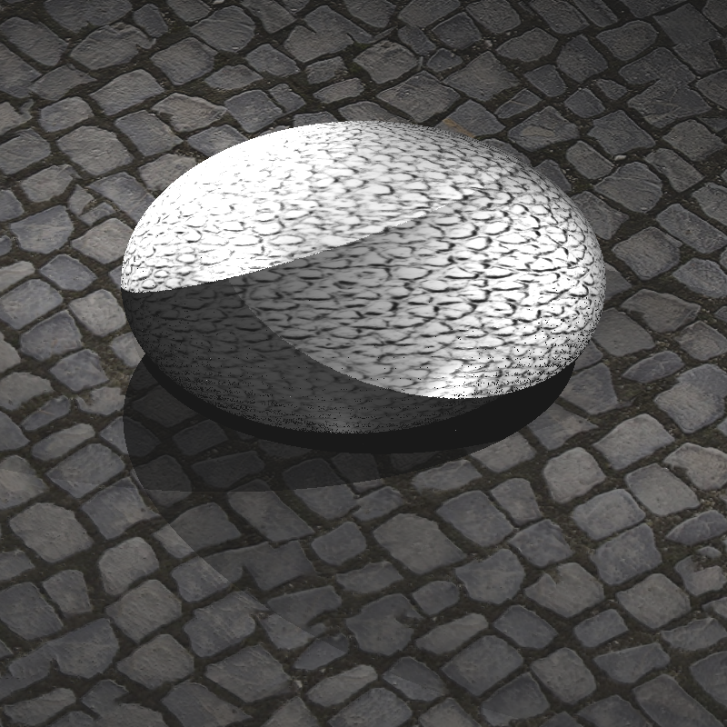

The image is much better, but the sphere is a bit weird. After some inspection and painful debugging sessions, I found out that $\textbf{B} \times \textbf{T}$ was not equal to $\textbf{n}$ for spheres. This was pretty interesting, and the reason (after almost 1 day of debugging) was that I used the local coordinate of the hit point in bitangent calculation instead of the local coordinate of the hit point _minus the center of the sphere_. When I fixed it, the result became this:


The result is not exactly the same as the reference image, where the bumps are much more pronounced. However, I have not managed to fix this issue and honestly, I do not know how to do it.

The last thing I did was fixing the parser so that I could render Veach Ajar. The result was pretty nice, but it had an error:

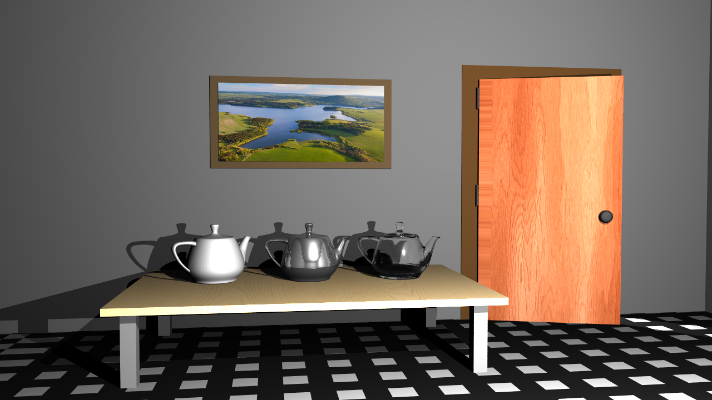

After doing another debugging session, I managed to learn the reason of the error in the floor. The error was actually something I did before: modulo with negative result. Since I had the macro and the right hand side of the modulo is again a power of 2 (2 to be exact), I used the same macro to do mathematically correct modulus. The result was pretty good:


I think the result looks pretty much correct at first glance. However, there are a few issues like the checkerboard pattern being a bit stretched out, the second teapot (in the middle) having a darker reflection of the table and a difference on the left side of the door that I cannot explain. In both images (mine and reference), the same part of the door texture becomes different compared to the remaining parts of the door, but the difference itself is different between the images. Here is the reference Veach Ajar for comparison:


The last thing I did was Galactica and background texture. This was pretty easy, so I will not delve into the implementation details here. However, the result was another interesting one:


The right side of the spaceship is black! After the last debugging session, I found out that the normals on the right side of the spaceship are the inverse of the correct normals after bump mapping! Well, the bump mapping does not affect the new normal that much in this image, so I tested the $\textbf{B} \times \textbf{T}$ in my calculator and found out that _they_ were the culprit. I fixed this by multiplying the tangent by $-1$ in the tangent and bitangent pre-calculation part if $\left(\textbf{B} \times \textbf{T}\right) \cdot \textbf{n}$ is negative (which means that the calculated normal and real normal are in opposite directions). When I fixed this, the image became pretty much the same as the reference one:


I guess the difference between my image and reference image is caused by the same reason behind the difference in bump mapping transformed.

Bump mapping without texture coordinates was actually much easier than my expectation. It also worked well, unlike image bump mapping. The whole implementation after `get_gradient` method I showed earlier is this:

```cpp
const auto g = textures->bump->get_gradient(hit_point, bump_factor);
const auto g_parallel = glm::dot(g, local_n) * local_n;
const auto g_perpendicular = g - g_parallel;
local_n = glm::normalize(local_n - g_perpendicular);
```

At the end, I tried to implement trilinear sampling. However, it is pretty difficult to do since it needs camera offsets on top of UV coordinates, which is pretty difficult to get in ray tracing. In the lectures, we discussed about trilinear sampling in ray tracing using ray differentials, which is also the approach taken in the PBR book. I more-or-less implemented it; however, the $\lambda$ results in negative values, which means that -after clamping- the mipmaps are not used at all. I would like to solve this problem, if I can. My current implementation is as follows:

```cpp
const auto d = -glm::dot(world_n, hit_point);
const auto tx = (-glm::dot(world_n, r.right_origin) - d) / glm::dot(world_n, r.right_direction);
const auto px = r.right_origin + tx * r.right_direction;

const auto ty = (-glm::dot(world_n, r.down_origin) - d) / glm::dot(world_n, r.down_direction);
const auto py = r.down_origin + ty * r.down_direction;

const auto dpdx = px - hit_point;
const auto dpdy = py - hit_point;

const auto dpdu = tangent;
const auto dpdv = bitangent;

const auto ata00 = glm::dot(dpdu, dpdu);
const auto ata01 = glm::dot(dpdu, dpdv);
const auto ata11 = glm::dot(dpdv, dpdv);
const auto inv_det_ = 1.0f / difference_of_products(ata00, ata11, ata01, ata01);
const auto inv_det = is_finite(inv_det_) ? inv_det_ : 0.0f;

const auto atb0x = glm::dot(dpdu, dpdx);
const auto atb1x = glm::dot(dpdv, dpdx);
const auto atb0y = glm::dot(dpdu, dpdy);
const auto atb1y = glm::dot(dpdv, dpdy);

auto dudx = difference_of_products(ata11, atb0x, ata01, atb1x) * inv_det;
auto dvdx = difference_of_products(ata00, atb1x, ata01, atb0x) * inv_det;
auto dudy = difference_of_products(ata11, atb0y, ata01, atb1y) * inv_det;
auto dvdy = difference_of_products(ata00, atb1y, ata01, atb0y) * inv_det;

dudx = is_finite(dudx) ? clamp(dudx, -1e8f, 1e8f) : 0.f;
dvdx = is_finite(dvdx) ? clamp(dvdx, -1e8f, 1e8f) : 0.f;
dudy = is_finite(dudy) ? clamp(dudy, -1e8f, 1e8f) : 0.f;
dvdy = is_finite(dvdy) ? clamp(dvdy, -1e8f, 1e8f) : 0.f;

const auto dx_vtc = glm::vec2(dudx, dvdx);
const auto dy_vtc = glm::vec2(dudy, dvdy);
const auto delta_max_sqr = std::max(glm::dot(dx_vtc, dx_vtc), glm::dot(dy_vtc, dy_vtc));
hi.lambda = 0.5 * std::log2(delta_max_sqr);
```

Until `dx_vtc`'s definition, the code is pretty much the same as in the PBR book, but it does not work for some reason.

## Results

Most of the cases I have shown so far have been a great deal of the test cases of the homework. Here are the remaining ones:


](./assets/galactica_dynamic.png)

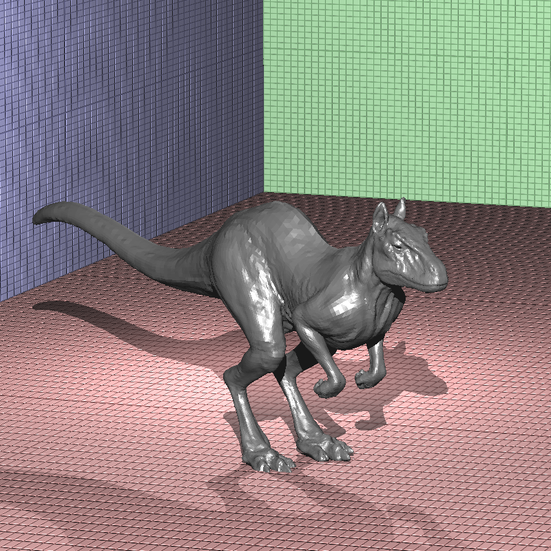


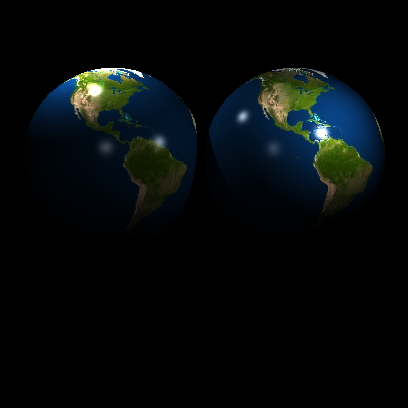


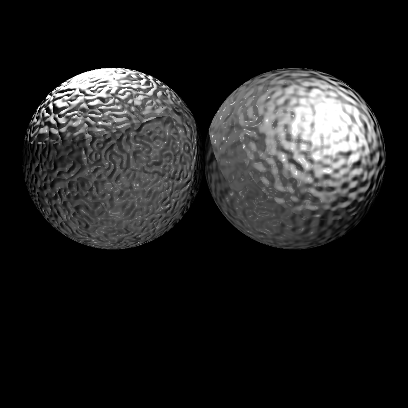


The scene looks much brighter than it should. I did not have enough time to inspect this problem. However, I guess the most problematic scene in this homework was this.


My dragon looks somewhat darker than the reference image. However, I don't think there is a problem in the implementation, debugging yielded the correct shading calculations. I think the difference between seeds is the reason of the difference.

## Performance

### Compiler Benchmark

All tests are done on the same computer (my computer, with the processor AMD Ryzen 7735HS) with both executables compiled with CMake's Release mode. This passes `-O3` to GCC and `/O2` to MSVC (both of which are the maximum possible optimization level for their respective compilers).

This is the comparison for single threaded performance. MSVC took 52.46% of time of GCC for initialization and 149.81% of time of GCC for rendering. Since rendering time dominated the total time, the ratio of total times is similar to the ratio of render times with MSVC taking 149.39% of time of GCC.

| Testcase                  | Init Time (GCC) | Init Time (MSVC) | Render Time (GCC) | Render Time (MSVC) |
| ------------------------- | --------------- | ---------------- | ----------------- | ------------------ |
| simple.xml                | 0.000738117     | 0.000329238      | 0.165579          | 0.296524           |
| two_spheres.xml           | 0.000684635     | 0.000298101      | 0.14317           | 0.198186           |
| instance/ellipsoids.xml   | 0.00118608      | 0.000405583      | 0.629211          | 0.929079           |
| instance/spheres.xml      | 0.000853679     | 0.000357677      | 0.443273          | 0.676024           |
| texture/sphere_perlin.xml | 0.000778413     | 0.000330491      | 0.799263          | 0.695065           |
| texture/wood_box.xml      | 0.0137741       | 0.0152521        | 0.662815          | 1.24051            |
| texture/cube_cushion.xml  | 0.0109649       | 0.00916525       | 0.65897           | 1.22823            |

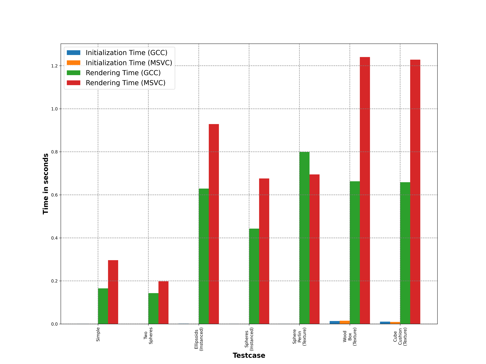


For multithreaded, I could do more cases. The performance difference is pretty similar in initialization with MSVC taking 58.12% of time of GCC while rendering with MSVC taking 187.58% of GCC. Except for a few cases like Other Dragon (where MSVC init time was also higher), almost all cases are dominated by rendering time; hence, the overall difference is pretty similar to rendering differences like in single threaded case. The render time gap is widened in multithreading, which I think is due to the fact that OpenMP version is older in MSVC.

| Testcase                        | Init Time (GCC) | Init Time (MSVC) | Render Time (GCC) | Render Time (MSVC) |
| ------------------------------- | --------------- | ---------------- | ----------------- | ------------------ |
| bunny.xml                       | 0.0259272       | 0.0137872        | 0.0252325         | 0.0422266          |
| cornellbox_recursive.xml        | 0.000824259     | 0.000408424      | 0.161469          | 0.338575           |
| other_dragon.xml                | 1.90039         | 3.12535          | 0.325022          | 0.492461           |
| scienceTree_glass.xml           | 0.0120762       | 0.00569955       | 0.428713          | 0.804977           |
| simple.xml                      | 0.00057505      | 0.000328117      | 0.0189683         | 0.035272           |
| two_spheres.xml                 | 0.000516159     | 0.000309414      | 0.0140184         | 0.023998           |
| instance/ellipsoids.xml         | 0.000937798     | 0.000409021      | 0.0525233         | 0.111615           |
| instance/metal_glass_plates.xml | 0.000948858     | 0.000450717      | 0.546101          | 1.08937            |
| instance/spheres.xml            | 0.000665289     | 0.000358539      | 0.0419996         | 0.0840711          |
| dist/cornellbox_area.xml        | 0.00105392      | 0.000420615      | 6.8415            | 14.0883            |
| dist/focusing_dragons.xml       | 0.750828        | 1.12671          | 42.3022           | 79.6751            |
| dist/metal_glass_plates.xml     | 0.0013245       | 0.000455512      | 16.7168           | 29.4731            |
| dist/spheres_dof.xml            | 0.000672332     | 0.000361171      | 3.86022           | 7.4544             |


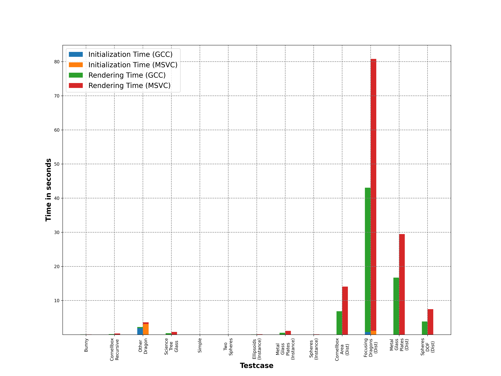

Since Focusing Dragons breaks the scale of the graph, here is the plot without that case:


### Texture Benchmark

And here is the big benchmark! MSVC took 72.2% of the time of GCC to initialize while taking 157.4% of the time of GCC to render scenes. As usual, render time dominates the total time, so the result was that MSVC took 150.7% of the time of GCC to start and finish the whole job.

| Testcase                             | Init Time (GCC) | Init Time (MSVC) | Render Time (GCC) | Render Time (MSVC) |
| ------------------------------------ | --------------- | ---------------- | ----------------- | ------------------ |
| bunny.xml                            | 0.0263316       | 0.0136175        | 0.0287202         | 0.0468452          |
| cornellbox_recursive.xml             | 0.00104192      | 0.000428546      | 0.238443          | 0.371436           |
| other_dragon.xml                     | 2.00303         | 3.22427          | 0.361571          | 0.525055           |
| scienceTree_glass.xml                | 0.0132723       | 0.0058431        | 0.478199          | 0.870111           |
| simple.xml                           | 0.000747665     | 0.000364378      | 0.0220329         | 0.0400985          |
| two_spheres.xml                      | 0.000703956     | 0.00033162       | 0.0223661         | 0.0281506          |
| instance/ellipsoids.xml              | 0.00115964      | 0.000440787      | 0.0824988         | 0.122891           |
| instance/ellipsoids.xml              | 0.000908217     | 0.000434246      | 0.081917          | 0.122259           |
| instance/metal_glass_plates.xml      | 0.00118432      | 0.000474137      | 0.677238          | 1.15823            |
| instance/spheres.xml                 | 0.000847961     | 0.000384326      | 0.0594592         | 0.094961           |
| dist/cornellbox_area.xml             | 0.00102876      | 0.000429739      | 9.2073            | 15.0258            |
| dist/focusing_dragons.xml            | 0.798259        | 1.17336          | 33.8644           | 58.6734            |
| dist/metal_glass_plates.xml          | 0.00130076      | 0.000488106      | 19.3926           | 31.6583            |
| dist/spheres_dof.xml                 | 0.000941244     | 0.00038669       | 5.78713           | 8.19425            |
| texture/bump_mapping_transformed.xml | 0.0748437       | 0.0851226        | 0.131904          | 0.148202           |
| texture/brickwall_with_normalmap.xml | 0.0211646       | 0.0224583        | 0.0862123         | 0.165274           |
| texture/cube_cushion.xml             | 0.0112663       | 0.00927417       | 0.0838197         | 0.16078            |
| texture/cube_perlin.xml              | 0.00131063      | 0.000526643      | 0.124521          | 0.272554           |
| texture/cube_perlin_bump.xml         | 0.00133815      | 0.000540437      | 0.137821          | 0.294797           |
| texture/cube_wall.xml                | 0.00995929      | 0.0110708        | 0.0790112         | 0.156742           |
| texture/cube_wall_normal.xml         | 0.0178733       | 0.0207233        | 0.0866704         | 0.163564           |
| texture/cube_waves.xml               | 0.00784749      | 0.00841713       | 0.0843926         | 0.162292           |
| texture/ellipsoids_texture.xml       | 0.0179725       | 0.0208412        | 0.0793805         | 0.118619           |
| texture/galactica_dynamic.xml        | 0.0648881       | 0.0352906        | 36.8541           | 70.4954            |
| texture/galactica_static.xml         | 0.0650413       | 0.0355861        | 0.376033          | 0.738424           |
| texture/killeroo_bump_walls.xml      | 0.488267        | 0.2826           | 0.270957          | 0.466517           |
| texture/plane_bilinear.xml           | 0.0183216       | 0.0203739        | 0.0278078         | 0.0332584          |
| texture/sphere_nearest_bilinear.xml  | 0.0191072       | 0.0204062        | 0.0894229         | 0.0906545          |
| texture/sphere_nobump_bump.xml       | 0.00758596      | 0.00873892       | 0.0956179         | 0.101027           |
| texture/sphere_nobump_justbump.xml   | 0.00756381      | 0.00877101       | 0.0929962         | 0.0978418          |
| texture/sphere_perlin.xml            | 0.000815369     | 0.000360108      | 0.14301           | 0.144179           |
| texture/sphere_perlin_bump.xml       | 0.000838961     | 0.000359113      | 0.160708          | 0.165377           |
| texture/sphere_perlin_scale.xml      | 0.000605388     | 0.000352115      | 0.143759          | 0.145046           |
| texture/wood_box.xml                 | 0.0141614       | 0.0155433        | 0.0816696         | 0.158564           |
| texture/wood_box_all.xml             | 0.0130072       | 0.0156655        | 0.0971621         | 0.175384           |
| texture/wood_box_no_specular.xml     | 0.00962229      | 0.0103033        | 0.0813137         | 0.156096           |
| texture/veach_ajar/scene.xml         | 0.438321        | 0.385892         | 54.9581           | 106.965            |
| texture/dragon/dragon_new_ply.xml    | 0.39476         | 0.601212         | 2.449             | 4.68368            |
| texture/mytap/mytap_final.xml        | 0.0444798       | 0.0562646        | 22.8472           | 36.0329            |

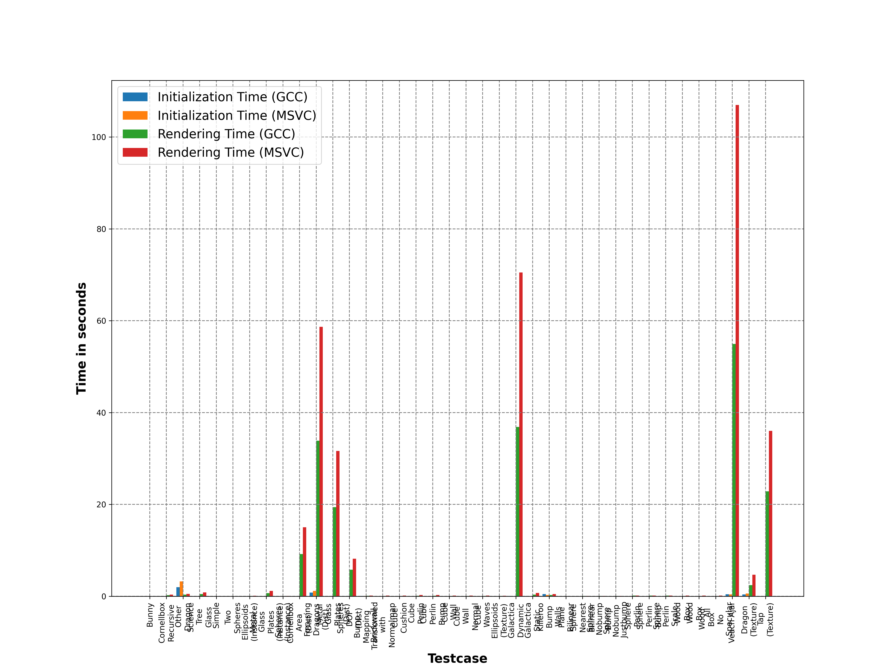


To make the scale less broken, here is the plot without Focusing Dragons, Metal Glass Plates (Dist), Galactica Dynamic, Veach Ajar and Tap (Texture):

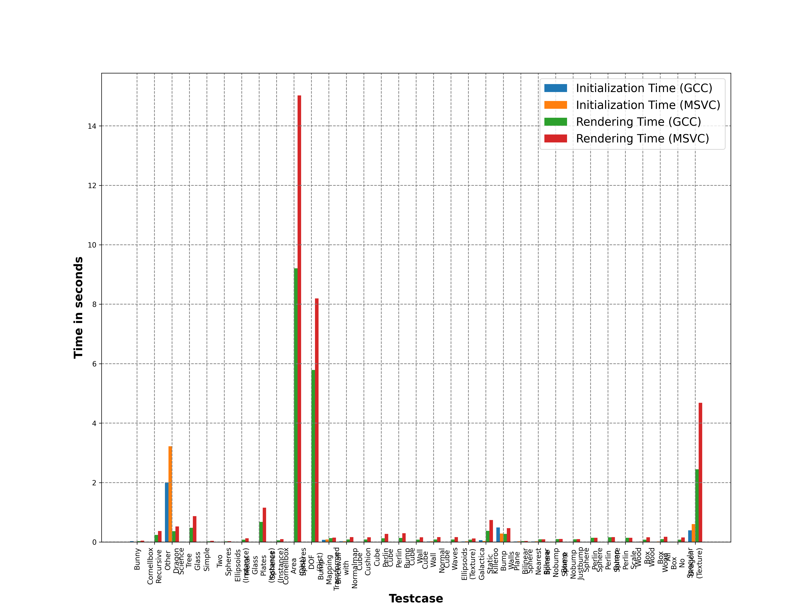


## Conclusion

As we get closer to the end of the semester, our outputs have been becoming better with each homework. Texture support is pretty much a must for any serious rendering engine, and the results show breathtaking images with the addition of this ancient technique. Unfortunately, this time, I have not learnt a life lesson from the homework, but I think learning 3 of such lessons from this series of homeworks has been a miracle in itself. Those homeworks still addict the student tho. I find myself to work on this instead of the term project, while my grades for the term project have been abysmal compared to the 795 homeworks. It is also sad that I have not been able to implement trilinear mapping properly.

[^1]: Oh, I have been waiting to do this reference since the end of that week! This is a reference to [<ruby>お<rp>(</rp><rt>O</rt><rp>)</rp></ruby><ruby>兄<rp>(</rp><rt>nii</rt><rp>)</rp></ruby><ruby>ち<rp>(</rp><rt>ch</rt><rp>)</rp></ruby><ruby>ゃ<rp>(</rp><rt>a</rt><rp>)</rp></ruby></ruby><ruby>ん<rp>(</rp><rt>n</rt><rp>)</rp></ruby> <ruby>は<rp>(</rp><rt>wa</rt><rp>)</rp></ruby> <ruby>お<rp>(</rp><rt>o</rt><rp>)</rp></ruby><ruby>し<rp>(</rp><rt>shi</rt><rp>)</rp></ruby><ruby>ま<rp>(</rp><rt>ma</rt><rp>)</rp></ruby><ruby>い<rp>(</rp><rt>i</rt><rp>)</rp></ruby>!](https://anilist.co/manga/100080/Oniichan-wa-Oshimai) (read as written above the characters), a manga/anime whose name is usually translated as "Older Brother is Done For!" (the "<ruby>お<rp>(</rp><rt>o</rt><rp>)</rp></ruby><ruby>し<rp>(</rp><rt>shi</rt><rp>)</rp></ruby><ruby>ま<rp>(</rp><rt>ma</rt><rp>)</rp></ruby><ruby>い<rp>(</rp><rt>i</rt><rp>)</rp></ruby>" part is translated as "to be done for" but it actually has some sort of a hidden meaning due to how it is written, <ruby>お<rp>(</rp><rt>o</rt><rp>)</rp></ruby><ruby>し<rp>(</rp><rt>shi</rt><rp>)</rp></ruby><ruby>ま<rp>(</rp><rt>ma</rt><rp>)</rp></ruby><ruby>い<rp>(</rp><rt>i</rt><rp>)</rp></ruby> instead of <ruby>お<rp>(</rp><rt>o</rt><rp>)</rp></ruby><ruby>仕<rp>(</rp><rt>shi</rt><rp>)</rp></ruby><ruby>舞<rp>(</rp><rt>ma</rt><rp>)</rp></ruby><ruby>い<rp>(</rp><rt>i</rt><rp>)</rp></ruby>) and which is one of my favorites. The phrase "X is done for" is also used throughout different parts of the manga translation. The phrase itself is of course used generally in English, but the translation of the manga uses it so extensively that the phrase has somewhat become an inside joke of the fans.

---
{
  "author": "Erencan Ceyhan",
  "lang": "en",
  "tags": ["C++", "Programlama", "Teknoloji", "Gönderi", "Ödev", "Işın İzleme"]
}
---

---
{
   "date": "[2024](/gönderiler/2024)-[12](/gönderiler/2024/12)-14 23:34:28+03:00"
}
---

