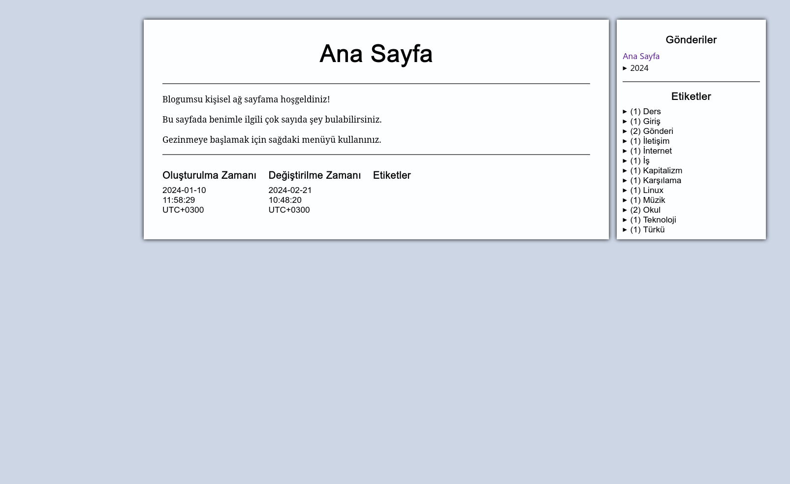

# Sitenin Yeni Tasarımı ve Toplum Üzerine

Ah evet, ben ile her gün tasarım değiştirmek, daha iyi bir ikili yok sanırsam. İşletim sistemim her gün ayrı temayla uyanıyor neredeyse, internet sayfamın da her gün yeni bir tasarımla uyanmaması için hiçbir sebep olmasa gerek. Sonuç olarak sitenin tasarımını tekrardan değiştirdim. Bu seferkinin daha iyi olduğunu söyleyebilirim, hâlâ daha minimalist havaya sahip ancak artık gradyanlar vb. hoşluklar var. Artık sayfadan ziyade karta benziyor gönderiler. Ayrıca navigasyon sistemi artık aşağıda, sayfanın sonunda. Bunu biraz [Microsoft'un blogundan](https://devblogs.microsoft.com) (ç)aldım diyebilirim. Aslında amacım daha çok, Windows 7 dönemlerinde (2010 civarı) Microsoft'un sitelerinin sahip olduğu havayı yakalamak idi ilk başta. Fakat aslında pek de Aero tarzı değil Microsoft'un o dönemki siteleri. Sitenin baş ve sonundaki dalga/cam karışımı görseller hariç oldukça düz tasarım bile diyebilirim.

Bu tarz bir tasarım için oldukça uğraştım ama bir türlü tam olmadı. Üstteki ve alttaki -bahsetmiş olduğum- hüzme/dalga/cam karışımı efektleri CSS ile yapmak pek hoş bir deneyim olmayacaktır -ki CSS becerim de oldukça sınırlı sonuçta benim-, nitekim sonucun ucuz bir kopya gibi görünmesi de gayet olası. Ben de onun yerine düz gradyanlar ve gölgelendirmeler kullanma kararı aldım. İlginçtir ki, az önce arşivde ekran görüntüsü almak için aradığım bir sayfayı bulamadım ama şu şekilde bir sayfa buldum Microsoft'un sitesinde:

Arka plandaki yeşil gradyanı çıkartırsak, benim mevcut tasarıma nispeten benziyor aslında.

Yine kıyas için eski ana sayfayı da koyabilirim sanırım.

Temel farklılıklardan birisi de “Değiştirilme zamanı” kısmını kaldırmam olsa gerek. Düzenleme zamanını tutmak çok da işlevsel değil bence; ki bilgisayar değiştirme gibi durumlarda (veya format atma gibi) indirme zamanım, dosya sistemi tarafından değişme zamanı olarak sayıldığından dolayı sıkıntı çıkıyor. Bu bilgisayara Linux yükledikten sonra, gönderi dosyalarının değiştirilme zamanlarını değiştirmek zorunda kalmıştım sırf bu yüzden. Ayrıca çok da önemli bir nitelik değil bana kalırsa, olası düzenlemeleri yaklaşık zamanlarıyla birlikte metinde belirtmek yeterli diye düşünüyorum. Düzenlemeler hakkında spesifik ve detaylı bilgi için de Git sayfasındaki commit geçmişi incelenebilir, herkese açık sonuçta. Etiketleri de rahat rahat yatay yapabildim bu tasarım değişikliği sayesinde.

Mevcut tasarımın üstüne ufak tefek değişiklikler yapabilirim sanırım. Gradyanları, bilhassa da şu gönderi/etiket/resim vs. arka planındaki gradyanı daha hoş görünen bir şeye çevirmeyi düşünüyorum.

Bunların yanında, geçmiş olduğumuz yaklaşık bir aylık süre içinde günlük yazmaya başladım. İlkokuldayken denediğimde her gün yazdığımdan dolayı daha çok bilgisayar log'larına dönmüştü, her saat ne yaptığımı falan yazıyordum. Bu sefer daha insancıl bir yaklaşımla yazmayı düşünüyorum. Beni etkileyen bir gün geçirdikten sonra o gün hakkındaki duygu ve düşüncelerimi, mümkün olduğunca kısıtsız biçimde (dilin ve benim dili kullanma becerimden kaynaklanan kısıtlar oluyor elbette) aktarmayı düşündüğüm bir yaklaşımdan bahsediyorum. Blog ile benzer bir amaç taşıyor aslında, ama blogda daha paylaşılabilir düşüncelerim oluyorken günlükte daha gizli -ve karanlık 🙃- düşüncelerimi ve duygularımı dökmeyi planlıyorum. Birinin dünyaya açılıyor olmasının etkisi olsa gerek bu tercihimde.

Ödevler bittikten sonra ama sınavlar henüz gelmemişken ciddi bir hayat amacı sorunu yaşayabiliyor insan. Ben yaşıyorum en azından. Yapılacak ödevlerin teslim tarihleri oldukça geç, yakın olanları (daha doğrusu geçmiş olanları) ise hâlihazırda yapmış durumdayım. Sınavlar yaklaşıyor ama hâlâ zaman var. Bütün bu durum içerisinde de mevcuttaki boş zaman rahatlık vermek yerine endişe veriyor. Bir bakıma _fırtına öncesi sessizlik_ durumu mevcut. Lise bitene kadar örnek öğrenci profilindeyken -ki hâlâ başarı vs.de sayılabilirim nispeten- artık okuldan nefret eden ve hatta bazı bazı salak salak korkuları bile olan birisi hâline gelmiş olmam üzücü bir yandan da. Farklı biri oldum bir bakıma üniversite dönemim içerisinde.

Bu aralar ciddi derecede “Erkeklere uygulanan toplumsal baskı” türünden videolara sarmış durumdayım. Bu cümleyi okuyan birçok insan -özellikle de feministler- böyle bir şeyin olmadığını bana söylemek için kendilerini yiyeceklerdir muhtemelen. Fakat böyle bir durum ciddi anlamda mevcut. En kötü kısmı ise, 19. yyda feministlerin yaşadığı baskının belki de daha fazlasını yaşıyor bu durum. Ayrıyeten, -özellikle de ülkemizdeki- feministler bu durumu -alternatifine kıyasla iyi sayılabilecek- “kadınların daha çok sorunu var”a indirgeyerek konuşmayı dağıtıyorlar. Toplumun erkeklere bakış açısında bir hata olduğunun farkına varan birisi -dişi/kadın/kız da olsa erkek de olsa- buna benzer sözlerle susturulmakta, sorunun var olmadığı gibi bir algı yaratılmakta. Genellikle de bu durumun arkasından Andrew Tate gibilerini suçlamak gelmekte. Elbette Tate iyi bir insan değil fakat sorunu Tate'çiliğe indirgemek de tozu halı altına süpürmekle eşdeğer. Richard Reeves bu konuda güzel bir tespitte bulunuyor: “Tate bunun sebebi değil, semptomu”. Günümüzde Türkiye gibi gelişmekte olan -veya gelişimi durmuş- ülkelerde dahi Tate gibi insanların, birçok genç erkeğin fikir babası olması kesinlikle bu gençlerin suçu değil. Sorun; bu erkeklerin sorunlarının dinlenmemesi, yok sayılması, hatta aşağılanmasından dolayı bu gençlerin; kendi sorunları hakkında -sakat bir biçimde olsa dahi- en azından _konuşan_ insanların peşinden gitmesidir bana kalırsa (ki Richard Reeves de buna benzer bir duruma bağlıyor Tate gibilerinin popülerliğini). Kısacası incel kültürü ve kızılhap gibi saçmalıklar bir neden değil bir sonuçtur. Benzer şekilde, toplumsal açıdan Batı toplumlarından bile bir on yıl kadar ilerde olan Japonya gibi ülkelerdeki “otçul erkek”lik mefhumunun sorumluları genç erkekler olarak görülmektedir. Ki Japonya görece ciddi ataerkil kalan bir ülkedir Batı ülkelerine kıyasla. Gelişmiş hatta gelişmekte olan dünyadaki genç erkekler toplumun kendilerinde yarattığı sorunlar için kendileri suçlanınca da bu gençlerin alternatif sağ gibi çukurlara düşmesi bana kalırsa kaçınılmazdı. Açık konuşmak gerekirse bu konudaki en makûl çözüm izlediğim bir misyoner videosundan geldi. Durumu kısaca özetledikten sonra çözüm olarak yereldeki Protestan kilisesine gidip orada bir toplum içinde hayat amacı bulmak üzerineydi çözüm. Spesifik olarak Protestan olması -hatta hem diğer Hristiyanlık mezheplerini hem de İslam gibi diğer dinleri de bu konuda yermesi- muhtemelen videonun misyonerlik amacından kaynaklı. Fakat benzeri şekilde din odaklı çözümler cidden oldukça mantıklı geliyor. Nitekim videonun ilk yarısındaki durum tespiti fazlasıyla doğru idi, oradan da genel olarak din odaklı çözümler gelebilir gayet, illa Protestan olmak zorunda değil.

Sorun temelinde, erkeklerin amaçsız kalmasından kaynaklanıyor. Bunun da nitekim çeşitli faktörleri var. En başta gelen sebep, mevcuttaki küresel atmosfer olsa gerek. İkinci Dünya Savaşı'nın bitiminden Sovyetler'in yıkılışına kadar olan sürede -niye uzattığımı bilmiyorum ama Soğuk Savaş kısacası- dünya, hiç olmadığı kadar barış ve refah içinde bir hâle geldi. Fakat Sovyetlerin yıkılışından kaynaklı oluşan boşluktan ötürü bu refah her geçen gün kaybolmakta. Bizim neslimizde -Z kuşağında- ise geçmiş refahın izi kalmamış gibi bir şey. Hatta Türkiye için bu durum daha da kötü, Türkiye Cumhuriyeti'nin refah zirvesi Soğuk Savaş'ta bile değil bundan 10-15 yıl önce oldu. Bu durumdan ötürü ciddi bir gelecek ve iş kaygısı mevcut. Toplumsal olarak dişinin para kazanmasını büyük ölçüde normalleştirilmiş olsak da -Türkiye'nin kabataslak gelişmiş bölgelerine odaklandığımızı varsayalım- dişilerin hâlâ daha para kazanmama gibi bir seçeneği varken erkekler evi geçindirmek _zorunda_. Olası bir iş kaygısının büyük ölçüde genç erkekleri etkilemesi nitekim normal. Eskiden bu gibi durumların sonucu savaş olurdu ancak artık savaş çok geçmiş ve toz tutmuş bir kavram. Bunun yanında günümüz erkekleri zaten savaşın olmayacağı bir dünyaya hazırlanmış durumdalar. Ha bu durum Türkiye gibi milliyetçiliğin ve orduculuğun yüksek olduğu bir ülkede nispeten daha az, genç erkek meselesini çoğu ülkeden daha kolay atlatabilirsek de muhtemelen bu duruma müteşekkir olmamız gerekir. Bütün bunların yanında, artık genç kızların da meslek edinmesi -hatta dünyada birçok yerde akranı erkeklerden daha yüksek tahsilat yapmaları, Türkiye'nin durumundan emin değilim ama benzeri durumun bizde de olduğunu bir yerlerde okumuştum- sonucunda apayrı bir sıkıntı oluşuyor. Zaten muhtemelen kendisinden daha yüksek tahsil yapmış bir karşı cins bireyden daha az kazanacağı için eğitimle uğraşmak tamamen gereksiz geliyor birçok genç erkeğe. Feminist kadınlar bile kendilerinden az kazanan erkeği kolay kolay kabul edemediği için eş bulup yuva kurmak da hayat amacı olmaktan çıkıyor. Bütün bunları topladığımızda varacağımız sonuç; çağdaş toplumun, genç erkeklere amaç vermeyi becerememesi olur. Nitekim genç kızlarda da benzeri amaçsızlık eğilimleri mevcut olsa da karşı cinsleri kadar şiddetli olmamasının da sebebi bahsettiğim üzeredir.

Peki bu durumda ne yapılabilir? Açıkçası, çoğu meselede olduğu gibi bunun çözümünün yine eski insanlarda olduğunu düşünüyorum ben. İnsanların toplumsal sorunlarının çoğunun çözümü durup düşündüğümüzde çözülebilecek sorunlar -bazı kronik olanları hariç-. Tarihte somut bir amaç bulmamış erkeklerin de başvurduğu düz çözüm, kendini din ve Tanrı'ya bırakmaktır genelde. En büyük savaşçılar neredeyse hep erkek olduğu gibi en ermiş insanlar da aynı şekilde neredeyse hep erkektir. Protestan misyonerliği olmak dışında bahsettiğim videonun doğru olduğunu söylememin sebebi de bu büyük ölçüde. Hipergami sebebiyle sıradan bir erkeği sevecek bir dişi bulmak imkânsıza yakın olabilir, lâkin Tanrı/Allah/Tengri artık hangisine inanıyorsak o varlığın sevgisi daima mümkün kalacaktır. Elimizden ekonomik hedefler alınsa bile erme süreci ile sonucunda varacağımız nokta her zaman hedeflenebilir bir amaç olacaktır. Bunun yanında din, oldukça toplumsaldır. Çağdaş bilim genel olarak erkeklerin pek sosyal olmadığını söylese de ben bunun çok büyük bir yanlış olduğunu düşünüyorum, erkekler de en az dişiler kadar sosyal varlıklardır. Sosyal bilimlerin neredeyse tamamen dişiler tarafından gerçekleştirilmesinden kaynaklı olarak erkeklerin sosyalleşmelerini dışavurma şekillerinin araştırmalarda fark edilmemesi de bana kalırsa doğaldır. Erkekler genellikle “sosyalleşme amaçlı sosyalleşme” -nam-ı diğer dedikodu- yapmaktan ziyade bir işi birlikte yapmak üzerine kurar sosyal becerilerini, yani takım çalışmasına. Ancak günümüzde teknoloji nedeniyle sosyal geribildirim pek mümkün olmamakta. Bunun dişi tipi sosyalleşmeye de büyük zararları olsa da erkek tipi sosyalleşmeye zararı tahminimce daha da büyüktür, ortak fiziksel eylem durumu ortadan kalkmaktadır çünkü. Dinî toplulukların en büyük artılarından birisi de muhtemelen bu tip sosyalleşmeyi mümkün kılmalarıdır. Din zaten içinden ticaret çıkarıldığında baya toplumcu kalan bir kavramdır.

Fakat bu sadece yüzeysel bir çözüm. Her erkek bu tip topluluklara katılamaz. Toplumsal bir sorunu birey bazında çözmek de sorunu halı altına süpürmektir. Mevcut toplumun bu sorunu çözebilme isteği olduğunu düşünmüyorum; halk, sorun her belirtildiğinde “Güneydoğu'da namus için öldürülen X kadın” diyen feministler ile dişilere ferrelerde gördükleri sapkın ve hayvancıl hareketleri uygulamak için can atan gayrikastî bâkirler olarak bölünmüş durumda neredeyse. İki gruba da meselenin ciddiyetini anlatmanın oldukça sancılı olacağını tahmin ediyorum. Arada kalan ve bu sorunların üzerine ya düşünmemiş ya da gerçekten mantığını çalıştırarak düşünmüş insanlar ise tek başlarına yeterli değiller tahminimce. Dolayısıyla toplumsal olarak nasıl bu çukurdan çıkacağımızı bilemiyorum. Elbette benim sosyal becerisi çok yüksek olmayan bir insan olmamdan ve örgütlenme işlerinden uzaklığımdan dolayı bu çıkmazda olmam tuhaf olmayabilir.

---
author: Erencan Ceyhan
lang: tr
tags:
- Blog
- Cinsiyet Meseleleri
- Eski İnternet
- Gönderi
- Okul
- Tasarım
- Teknoloji
- Toplum
date: '[2024](/gönderiler/2024)-[03](/gönderiler/2024/03)-23 10:12:16+03:00'
---
