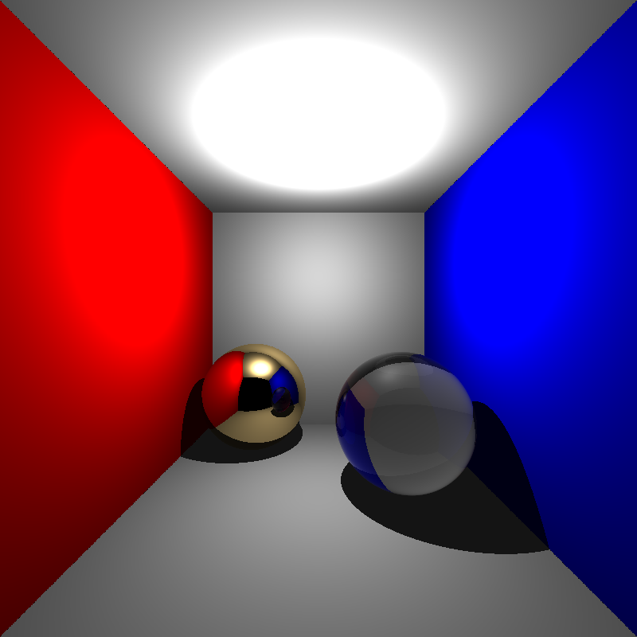
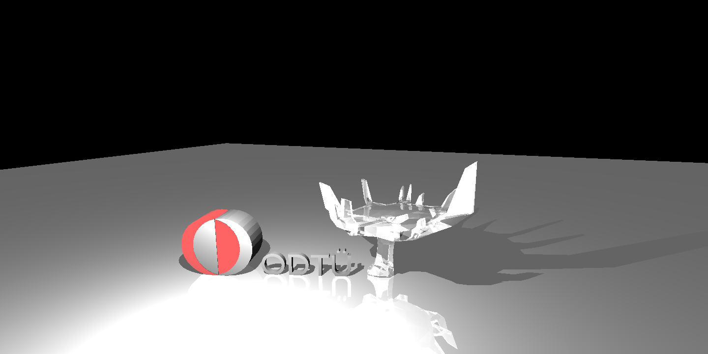
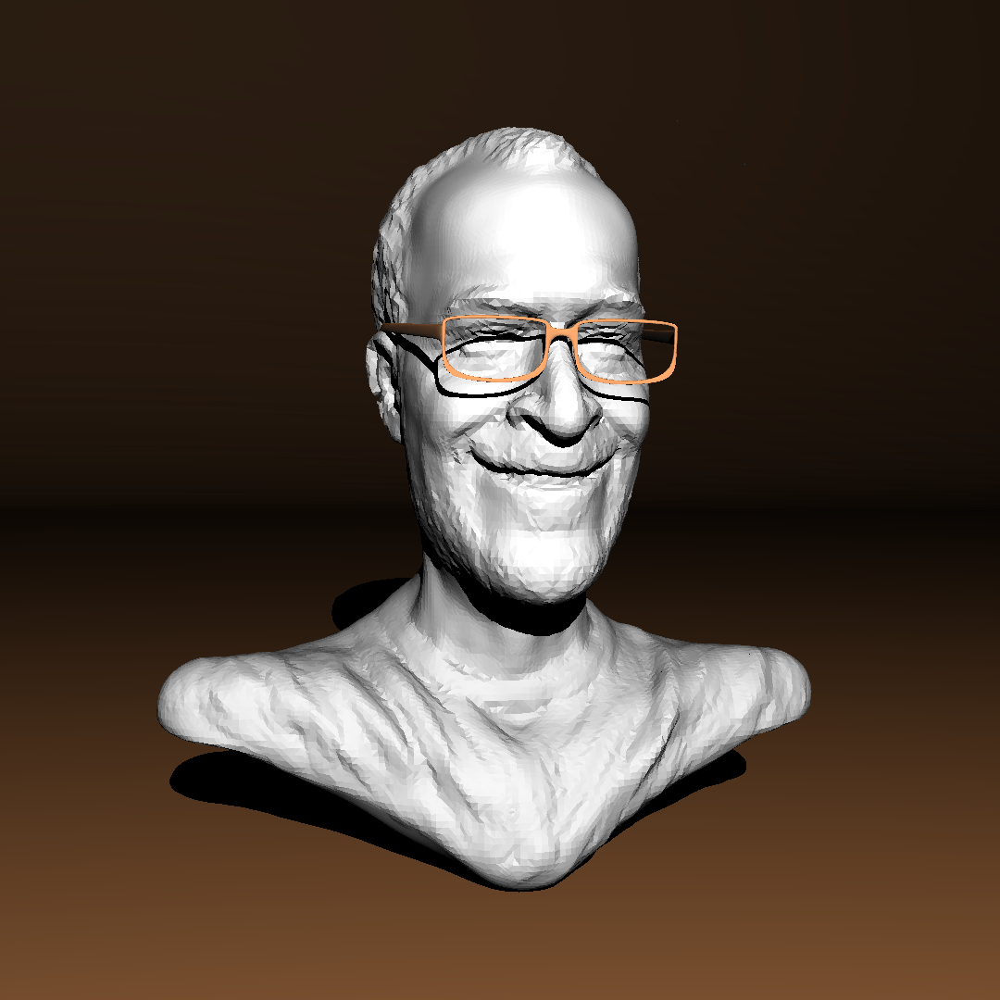
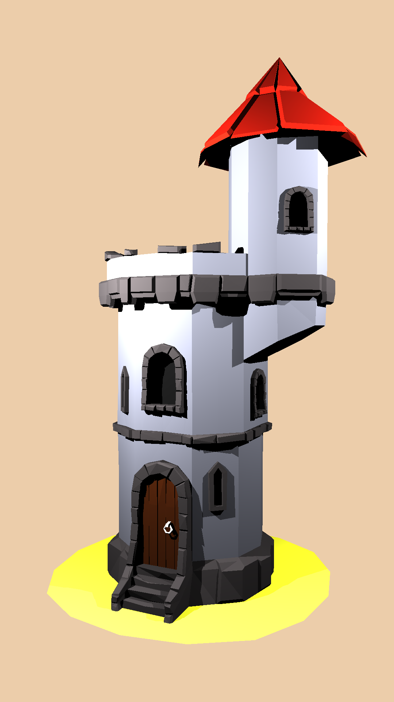
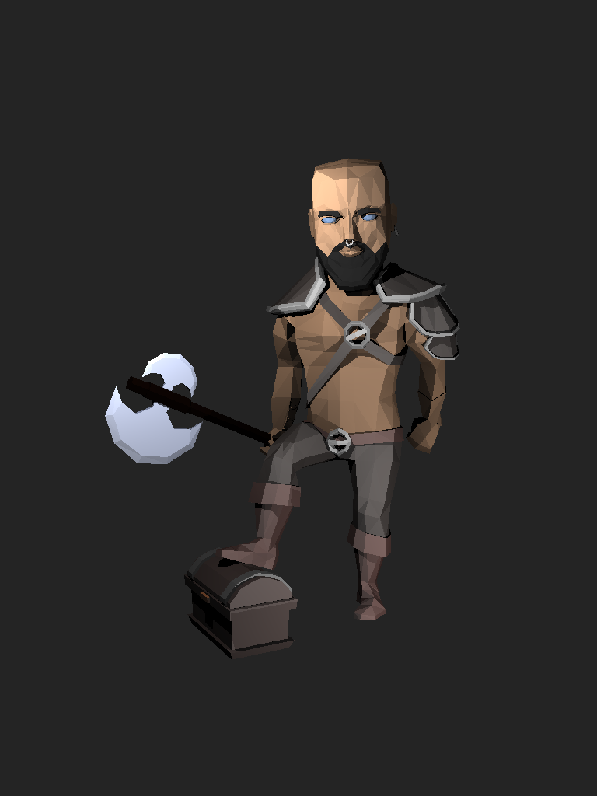

# CENG795-HW1: Simple Recursive Raytracer

Hello everybody. Welcome to my blog post about the first homework of the course CENG785, Advanced Ray Tracing.

Ray tracing is a fundemental approach to rendering in the computer graphics. Our homework was to implement a simple one have a base for more advanced concepts in the ray tracing.

In CENG477, we had actually written a ray tracer that pretty much did what we need to do for this homework. However, our implementation was

1. A collaborative one; hence, using it in this homework would be non-ethical.
2. Probably more importantly, since that homework was a one-time one unrelated to the other homeworks of CENG477, our architecture was _bad_.

These two points made me to create my own implementation from scratch. There is a famous quote in software engineering by Kent Beck:

> Make it work, make it right, make it fast.

In one interpretion; first part means a working code, second part means a clean code and the third part means a performant code. Due to  my illness, I only managed to do the first part and the second part, latter being somewhat partial.

## Implementation

### Architecture

At first, I tried to create a scene structure. To achieve this, I skimmed the given XML files so that I can see which data will be given to us. I created the `rt::scene` struct, which consisted of several data like `background_color` and `shadow_ray_epsilon`. Some data is actually global while not being defined in the `<Scene>` tag, like `ambient_light`. Other data is all lists of objects, which I represented with simple `std::vector`s. Unlike our CENG477 implementation, I chose to keep indexed rendering and keep the meshes since the upcoming BVH implementation will benefit from meshes.

Afterwards, I implemented simple ray casting, albeit inside the `main` function. It simply looped over every mesh triangle, every standalone triangle and then every sphere. I took the intersection functions from previous homework since finding a Möller-Trumbore implementation is suprisingly difficult and I did not want to calculate the determinant formulas by myself. In this stage, a ray knew how to intersect with a triangle or a sphere.

### Shading


The next thing was implementing shading. For materials, I used a weird combination of object oriented and functional programming approaches by using inheritence for the materials (a simple material with ambient, diffuse and specular shading; mirror and dielectric materials inheriting from simple material while adding their attributes and a conductor inheriting from mirror while adding its own attributes) but using sum types (`std::variant`) for dispatching. I used `std::visit` to dispatch a shading request. The resulting shading function is as the following code snippet:

```cpp
glm::vec3 rt::shade(shading_arguments args, material m) {
   if (args.recursion_depth > args.s.max_recursion_depth) {
      return glm::vec3();
   }
   return std::visit([&](auto m) { return shader(args, m); }, m);
}
```

The function `shader` is actually an overloaded function. I tried to use `std::visit` directly with `shader`; however, it seems like one cannot give additional arguments to `std::visit`. This is actually possible, but I needed to wrap `shading_arguments` to an `std::variant`. This would create a 1x4 jump grid for `std::visit`, which is the same as current jump array of size 4. However, this would not be clean. A simple lambda that delegates the `shader` call is much simpler and cleaner.

After having a working dispatch system, I decided to split the ray casting from the `main` function. Now, `rt::scene` has the method `ray_cast`, which takes a ray, intersects it with every object in the scene and outputs the t value, the surface normal and the material id of the successful hit. The intersecting object is not needed apart from these three information. The next thing I will do for this homework chain is combining these three parameters into an `rt::hit_info` structure to make the function signatures cleaner.

This `ray_cast` method is used in the `main`. Now, `main` function

1. Creates the ray from the camera using `rt::camera::create_ray` method
2. Casts the ray using `ray_cast`
3. Gets the result of the shading if the hit succeeds
4. Clamps the result of shading
5. Writes the resulting image as PNG.

When I reached this point, the architecture of this homework was done. The only remaining parts were material shading.

#### Simple

Simple material was, well, simple. I created ambient, diffuse and specular as standalone functions so that I could test them independently. The result was successful.


Apart from a few dark spots on the border between planes due to floating point precision error, this image is more-or-less identical to the reference image. I also tried spheres and two spheres, which were also successful.


I also tried Spheres Mirror case while the mirror material returned `{0, 0, 0}`. The result was also correct if we look at only the non-mirror materials.


#### Mirror

At this point, I had a successfully working ray tracer with shadows. The next thing I did was reflection. The material `rt::mat::mirror` has the mirror coefficient and needs recursive ray tracing. Since `rt::scene::ray_cast` and `rt::shade` functions were done, doing recursive ray tracing was a piece of cake.

```cpp
static glm::vec3 shader(shading_arguments args, mat::mirror mat) {
   auto ret = shader(args, static_cast<mat::simple>(mat));
   auto ray = rt::ray{
       .origin = args.hit_point + args.n * args.s.shadow_ray_epsilon,
       .direction = glm::reflect(args.ray_dir, args.n)
   };
   float t_reflect;
   glm::vec3 n_reflect;
   int mat_reflect;
   if (args.s.ray_cast(ray, t_reflect, n_reflect, mat_reflect)) {
      const glm::vec3 reflected_color = rt::shade(
          {args.s,
           args.hit_point,
           ray.apply(t_reflect),
           n_reflect,
           ray.direction,
           args.recursion_depth + 1,
           args.n_incoming},
          args.s.materials[mat_reflect]
      );
      ret += mat.mirror_reflectance * reflected_color;
   }
   return ret;
}
```

This was the whole mirror material implementation. Almost half of the function is actually passing the right parameters to the `rt::shade`. I incremented `args.recursion_depth` here, but at first I did not. I was confused when the program got stuck when I tried Spheres Mirror test case. At that time, I actually forgot to pass recursion depth as parameter. When I added it and passed incremented depth to the `rt::shade` call for reflection, I got a successful result.


#### Conductor

The next thing I needed to do was conductors. Since conductors do not have refraction, they were pretty easy. Actually, they are pretty much the same as mirrors with mirror reflectance depending on the viewing angle.

$$
R_s = \frac{\left(n^2+k^2\right) - 2n\cos\theta + \cos^2\theta}{\left(n^2+k^2\right) + 2n\cos\theta + \cos^2\theta}
$$

$$
R_p = \frac{\left(n^2+k^2\right)\cos^2\theta - 2n\cos\theta + 1}{\left(n^2+k^2\right)\cos^2\theta + 2n\cos\theta + 1}
$$

$$
F_r = \frac{1}{2}\left(R_s + R_p\right)
$$

Getting $\cos\theta$ is easy, actually, since $-\textbf{d}\cdot\textbf{n}$ gives the $\cos\theta$ while being very easy to calculate. Afterwards, I separated the terms (e.g. $\left(n^2+k^2\right)$ appears four times in the formula) as temporary variables and combined them to get $F_r$, which I then multiplied with the supplied `mirror_reflectance` in the material definition to get the final `reflectance`. Recursive ray tracing part of the code was exactly the same as `rt::mat::mirror` except using the calculated `reflectance` instead of `mirror_reflectance`. I then tried Cornellbox Recursive. The result was successful until I checked the output and saw that the conductor sphere was brighter by a small amount. I then tried to hunt down the error and finally found that I wrote the minus sign in the nominator of $R_s$ wrong and put plus sign, making $R_s$ always $1$.


After fixing that small mistake, the result was correct except the non-implemented dielectric material.


#### Dielectric

And here comes the most difficult part of this homework. Calculating the Fresnel equations was easy, even easier than conductors. However, there were many edge cases about the rays.

The first problem was with $\cos\theta$. When exiting the material, the ray hits the backface of an object. This makes $\cos\theta$ negative, which breaks the Fresnel equations. I discovered this after a couple of painful debug sessions and seeing that the $R_{||}$ and $R_{\bot}$ values become negative. I solved the problem by taking the absolute value of the $\cos\theta$ after calculating a boolean `is_backface` to denote whether the hit was to a frontface or a backface. Since there is no intersecting object in any of the scenes, I assumed that any hit to a dielectric material either came from air/void or went to air/void. This made refraction index calculations a bit easier, but still, I somewhat supported such a case by having an `rt::shade` parameter named `n_incoming`. However, I did not use it and hard-coded `1.0` as one of the refraction indices. If the hit was backface, I swapped positions of the refraction indices. After calculating

$$
1 - \left(\frac{n_1}{n_2}\right)^2 \left(1 - \cos^2\theta\right)
$$

I decided whether a hit results in total internal reflection or not by checking its sign. Total internal reflection was pretty easy, it was just a reflection without any `mirror_reflectance`. The hardest part was refraction. I then calculated $R_{||}$ and $R_{\bot}$ to calculate the $F_r$ and $F_t$. I casted two rays and added their colors to the simple-shaded color of the material. I calculated the epsilon offsets based on the value of `is_backface` so that refractions started at the back of the surface and the reflections started at the front of the surface. Finally, I added Beer's Law when the resulting ray was inside the object, i.e. refraction rays in frontface hits and reflection rays in backface hits. I assumed that no material would have refraction index smaller than $1$, so that the total internal reflection can only happen when exiting the object.

For Cornellbox Recursive, the result was correct.



However, when I tried ScienceTree Glass, it did not work. The glass was too bright in places with small surface area.



I tried to debug this problem with no success. As a last resort, I asked the instructor in the course about any possible obvious problem of my result. He said that backface hits should not result in simple shading. After learning this, I wrapped `rt::shader` call with `rt::mat::simple` cast to an `if` that checks if the hit was a frontface one. The result was better but there was still a problem.


With a spontaneous inspiration, I decided to clean up the dielectric `rt::shader` by inverting the normal if the hit was backface, instead of checking whether the hit was backface in various places to change things such as the sign of the added vector used as offset. For example, for reflection, the ray creation was this:

```cpp
auto ray = rt::ray();
if(is_backface) {
   ray = rt::ray{
      .origin = args.hit_point - args.n * args.s.shadow_ray_epsilon,
      .direction = glm::reflect(args.ray_dir, args.n)
   };
} else {
   ray = rt::ray{
      .origin = args.hit_point + args.n * args.s.shadow_ray_epsilon,
      .direction = glm::reflect(args.ray_dir, args.n)
   };
}
```

After putting

```cpp
if (is_backface) {
   args.n *= -1.0f;
}
```

at the start of the function after calculating `is_backface`, I changed the previous ray creation to this:

```cpp
auto ray = rt::ray();
ray = rt::ray{
   .origin = args.hit_point + args.n * args.s.shadow_ray_epsilon,
   .direction = glm::reflect(args.ray_dir, args.n)
};
```

The result should have been the same; however, it was not. I thing I forgot to do `if` based selection in some places where the normal was used, which would be the reason why inverting the normal itself would result in a correct result. Nevertheless, I was happy that the problem was solved and now I had correct ScienceTree Glass!

### PLY Format

The last remaining part was the PLY format parser. I used a very ad-hoc one. Since the PLY files we were given will be the same ones that our ray tracers will be tested on, I observed the structure of the given files and came into the conclusion that the only difference was whether there are normals in the vertex data or not. My parser pushes the vertex data to the global vertex array, pushes the triangles' vertex ids and shifts these ids so that the ids match the ones in the global vertex array (since the ids in the PLY file are relative to the vertices defined by the same file). I tested with Akif Uslu's ton Roosendaal case since it had the smallest PLY files among all the given test cases. After a few errors in integer offsets, I managed to render ton Roosendaal successfully.



I guess the cases of Akif Uslu and Deniz Sayın use smooth shading (`shadingMode="smooth"`), so the result is different, the surfaces look less smooth in my outputs. Nonetheless, it looks correct to me.

After having PLY support, I tried the beast, or the dragon, namely the Other Dragon. Other Dragon has 1.8 million triangles, all having conductor material. In my first try, the result was a bit off. Since Other Dragon uses a `lookAt` camera instead of a normal one with image plane directly defined, I calculated the top-right corner's world coordinates differently. It should have been right. However, the result was as following:


I debugged the camera and saw that the aspect ratio was `1`, which was very wrong since the image is `800x480`! After skimming the aspect ratio calculation, I saw that I used integer division instead of float division when calculating the aspect ratio. A rookie mistake.

Unfortunately, I lost the time measurement for this image and I am too lazy to redo it. However, I tested Other Dragon on Inek and recorded the time, which you can find in [here](#performance). A whopping 4 hours! I remember the first test on my computer was not that different, maybe around 3.5 hours! This is insane. On top of this, the result is actually a bit different, the image is a bit more noisy compared to the base image. Since I did not want to redo this huge scene, I gave up about fixing it. The result is as follows:


I also tested with a few other scenes. However, I think the scenes I have tested so far are enough to cover more-or-less every part of this ray tracer.

## Other Scenes






Unfortunately, I do not have enough patience and time for Chinese Dragon Lobster and Trex cases, all of which take a great deal of time.

## Performance

| Test Case              | Time (seconds)                |
| ---------------------- | ----------------------------- |
| Berserker              | 9.588                         |
| Bunny                  | 3.66                          |
| Car                    | 28.916                        |
| Car Front              | 30.306                        |
| Cornellbox             | 0.258                         |
| Cornellbox Recursive   | 0.237                         |
| Low Poly               | 29.442                        |
| Other Dragon (on Inek) | 15122.9 ($\approx$ 4.2 hours) |
| ScienceTree Glass      | 29.112                        |
| Spheres                | 0.215                         |
| Spheres Mirror         | 0.183                         |
| Tower                  | 36.438                        |
| Two Spheres            | 0.173                         |
| Windmill               | 31.655                        |

I compared my result with the results in the blog posts of the other students and my ray tracer is around 2-3x slower. However, these students actually implemented backface culling while I did not. In a normal mesh, around half of the triangles are backfacing; hence, I think this can explain the difference, their ray tracers skip about half of the triangles of a mesh while mine does not. Implementing it would be easy actually, I needed another ray casting function, which skips backface triangles depending on a boolean flag, which can be templated since it is known at compile time. Dielectric materials then would use the version that accepts backface triangles while the others would use the version that skips those triangles. However, I am too lazy to do this, even though I will probably do such an optimization in the next homework.

## Conclusion

Even though this homework did not improve me that much, it is still an important one since all the other homeworks depend on this one. Having a clean and extendable codebase is a crucial skill transcending fields of computer science and our university has very few opportunities to hone those skills. Developing a non-toy system is a skill on its own, and making it performant is another kind of beast. This homework is the start of a journey where we will need to tackle that beast and I think this makes this homework chain one of the most important parts of our career, and even our hobby life if we want to.

---
{
  "author": "Erencan Ceyhan",
  "lang": "en",
  "tags": ["C++", "Programlama", "Teknoloji", "Gönderi", "Ödev", "Işın İzleme"]
}
---

---
{
   "date": "[2024](/gönderiler/2024)-[10](/gönderiler/2024/10)-25 23:27:09+03:00"
}
---

