# CENG795-HW6: The End of the Homework to End All Homeworks

[^1]

- [Implementation](#implementation)
  - [BRDF](#brdf)
  - [Path Tracing](#path-tracing)
    - [Monte Carlo Path Tracing](#monte-carlo-path-tracing)
    - [Object Lights](#object-lights)
    - [Importance Sampling](#importance-sampling)
    - [Russian Roulette](#russian-roulette)
    - [Next Event Estimation](#next-event-estimation)
    - [Splitting](#splitting)
- [Results](#results)
- [Performance](#performance)
- [Conclusion](#conclusion)

Kon'nichiwa everybody! Finally, the semester is finished, with only this homework and the final project remaining. Unfortunately, the future seems a bit bleak for me. Even though not as bad as [HW2](/posts/2024/11/ceng795-hw2) was, path tracing is unfortunately not correct in its current form. It becomes even worse when I consider that the instructor extended the deadline by more than one week to let us concentrate on the homework after our final exams. It is a great shame on my part! I guess that the main reason of my failure was pretty much the same with the HW2's failure, my over-confidence to do the homeworks. It seems like managing to do three consecutive homeworks correctly, each in one or two days, inflated my ego, resulting in this mess.

## Implementation

### BRDF

BRDF was supposed to be implemented in the previous homework; however, it was postponed to this one, so now we needed to implement it. In the homework, we need to implement numerous BRDFs:

1. Original Blinn-Phong
2. Original Phong
3. Modified Blinn-Phong and its normalized variant
4. Modified Phong and its normalized variant
5. Torrance-Sparrow

In total, there are actually 7 BRDFs that can be used, two of which are normalized variants. The Original Blinn-Phong BRDF is actually the one we have used so far, so I started with it. The first thing I did was to change the scene `brdf_blinnphong_original` so that it used usual `PhongExponent` in material instead of using the `Exponent` in the BRDF. The result was, well, correct, which is to be expected if we have implemented the shading calculations correctly so far. An almost pixel-perfect copy of the ground truth, always good to have. Afterwards, I started refactoring the code. So far, my code did the shading like this (in pseudocode):

```
foreach light in lights:
    w_i := Ray::from_to(hit_point, light.point())
    if ray.is_in_shadow():
        continue
    diffuse_color := diffuse_reflectance * diffuse(light, w_i)
    specular_color := specular_reflectance * specular(light, w_i, w_o)
    result += diffuse_color + specular_color
```

This actually somewhat hides the rendering equation

$$
L(w_o) = k_e + \int L(w_i) f(w_i, w_o) \cos\theta_i dw_i
$$

Here $k_e$ is the emission (denoted by radiance in the homework) and the integral is the same as the one we know from the lectures. However, my previous approach calculates $L(w_i)$ twice, first in `diffuse` and again in `specular`. It also separates $f(w_i, w_o)$ to both of them and calculates $\cos\theta_i$ in `diffuse`, whereas in the $f(w_i, w_o)$, diffuse actually does not depend on $\cos\theta_i$, while `specular` reflectance actually needs to use it but does not here since in actual $f(w_i, w_o)$, $\cos\theta_i$ becomes part of denominator, eliminating the $\cos\theta_i$ in the integral.

BRDFs on the other hand define $f(w_i, w_o)$, yet as I said in the previous paragraph, I cannot take out $f(w_i, w_o)$ from the current calculation, it is pretty much integrated in the calculations. Hence, I refactored the whole shading calculations, which actually made my mode more modularized compared to the previous one. Currently, the calculations look like this:

```
foreach light in lights:
    w_i := Ray::from_to(hit_point, light.point())
    if ray.is_in_shadow():
        continue
    cos_theta = dot(w_i, n)
    f = brdf.apply(w_i, w_o)
    L = light.getIrradiance()
    result += L * f * cos_theta
```

This actually needed two different refactors on my part: the BRDF and the lights. The `light.point()` in the loops were implemented in the shading function, which made the code more complex since the shading code was littered with light sampling code, especially for area and environment lights. I fixed this by making methods in the lights, which were previously POD structs, that returns a sample point on the light. For point or spot lights, this point is always the position of the light. For directional lights, this is the hit point offset by the negative of the direction of the light (for more information about this approach, see the [relevant section](/posts/2024/12/ceng795-hw5/#directional-lights) in the HW5), environment lights are similar but the positive of the direction instead of negative and the direction is randomly sampled from the upper hemisphere. Area lights also use the usual jittered random sampling that I have been using so far, only relocated to a different function.

Since I started the relocation of light sample point calculations, I also relocated the light irradiance calculations to the same place. Different lights have different irradiance characteristics, point and area lights are attenuated using the inverse square law, environment and directional lights do not attenuate at all and spot lights use falloff angles. All of these differences are abstracted in `light.getIrradiance()` call, which simplified the code greatly.

With this, the $L(w_i)$ of the rendering equation was done. However, $f(w_i, w_o)$ remained. For that, I needed to parse BRDFs, which I did. First and only time in this homework chain, I used `shared_ptr` since BRDFs can be shared by multiple materials. Usually, I use plain references for this purpose, which I did to share `Image`s between `TextureMap`s; however, this time there is a difference that materials can create new BRDFs if they don't define their BRDF. By default, a material without defined BRDF must use an `OriginalBlinnPhong` BRDF with exponent equal to the `PhongExponent` of the material. The last thing I want to add is that I put the BRDFs in an `std::vector`. Did you see the problem? If I add a new BRDF while parsing a material, the references of the BRDFs of all the previous materials would be invalidated if that vector reallocates! Yikes! I came across this problem in my compilers course in the previous term while storing references to variable declarations while doing variable resolution, but if a declaration defined a new variable, it would push to the variable declarations of the current scope, invalidating every reference used previously. This caused a great deal of headache, so I have been more cautious about this since then. Interestingly, Rust would catch this error at compile time, since the BRDF references in the materials borrow the vector immutably, while pushing to the vector borrows the vector mutably, and by the main rules of Rust's borrow checker, it is illegal to hold both mutable and immutable references to the same value. There are actually two other ways to solve this: by using indices and pre-allocating the vector. I actually used former for various things, but I am tired of passing the needed arrays to functions, since indices by themselves are useless. Latter is pretty hard since counting the number of BRDFs in the scene needs a loop over all BRDFs. This is not a big problem, but slapping `std::shared_ptr` was much easier, so I went with that route.

After rambling about my `shared_ptr` choice, let's continue with BRDFs. Implementing the virtual method `f` was somewhat easy, since the formulas have been given to us in the `brdf.pdf` in Odtuclass. The formula of `OriginalBlinnPhong` is actually not given there but it can easily be found from the given formula of `OriginalPhong`, where we just replace $\cos^p(\alpha_r)$ with $\cos^p(\alpha_r')$, where $\alpha_r'$ is the angle between the normal and the half vector, instead of the angle between the normal and the perfect reflection of $w_i$. Hence, the formula of `OriginalBlinnPhong` is as follows:

$$
\begin{cases}
    k_d + k_s \frac{\cos^p(\alpha_r')}{\cos\theta_i} &\quad \theta_i < 90\degree\\
    0 &\quad\text{otherwise}
\end{cases}
$$

Converting this to C++ was pretty straightforward:

```cpp
const auto cos_theta = std::max(0.0f, glm::dot(w_i, n));
if (cos_theta <= 0.0f) {
    return glm::vec3(0.0f);
}
const auto h = glm::normalize(w_i + w_o);
const auto cos_alpha_prime = std::max(0.0f, glm::dot(h, n));
return k_d + k_s * std::pow(cos_alpha_prime, exponent) / cos_theta;
```

Apart from Torrance-Sparrow, all the BRDFs were pretty straightforward to implement, similar to `OriginalBlinnPhong`. Normalizing was also pretty easy and I did it inline instead of creating a new BRDF like `ModifiedBlinnPhongNormalized`. For example, here is `ModifiedBlinnPhong`:

```cpp
const auto cos_theta = std::max(0.0f, glm::dot(w_i, n));
if (cos_theta <= 0.0f) {
    return glm::vec3(0.0f);
}
const auto h = glm::normalize(w_i + w_o);
const auto cos_alpha_prime = std::max(0.0f, glm::dot(h, n));

constexpr auto DIFFUSE_NORMALIZER = float(1.0f / std::numbers::pi);
const auto SPECULAR_NORMALIZER = float((exponent + 8) / (8.0f * std::numbers::pi));

const auto diffuse_normalizer = is_normalized ? DIFFUSE_NORMALIZER : 1.0f;
const auto specular_normalizer = is_normalized ? SPECULAR_NORMALIZER : 1.0f;

return k_d * diffuse_normalizer + k_s * specular_normalizer * std::pow(cos_alpha_prime, exponent);
```

As you can see, the `_NORMALIZER` and `_normalizer` parts are the only differences, where the function chooses between `1.0f` and normalizing coefficients.

The results are almost pixel-perfect copies of the ground truth images.


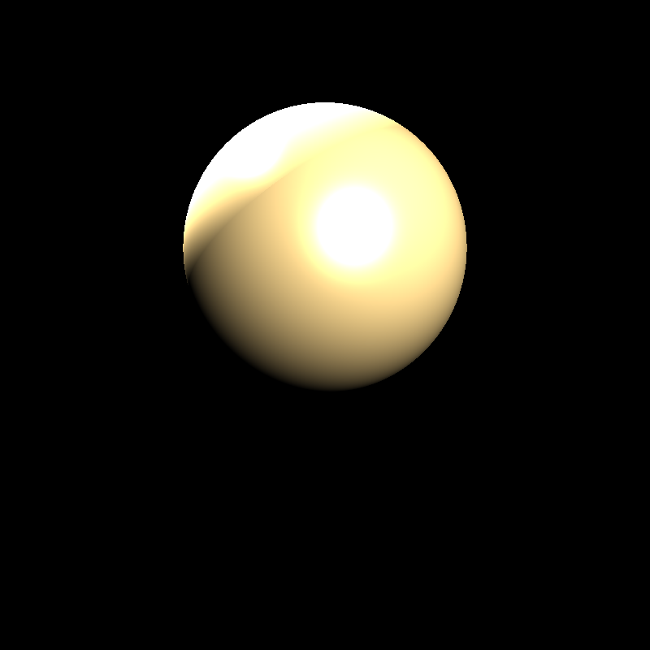

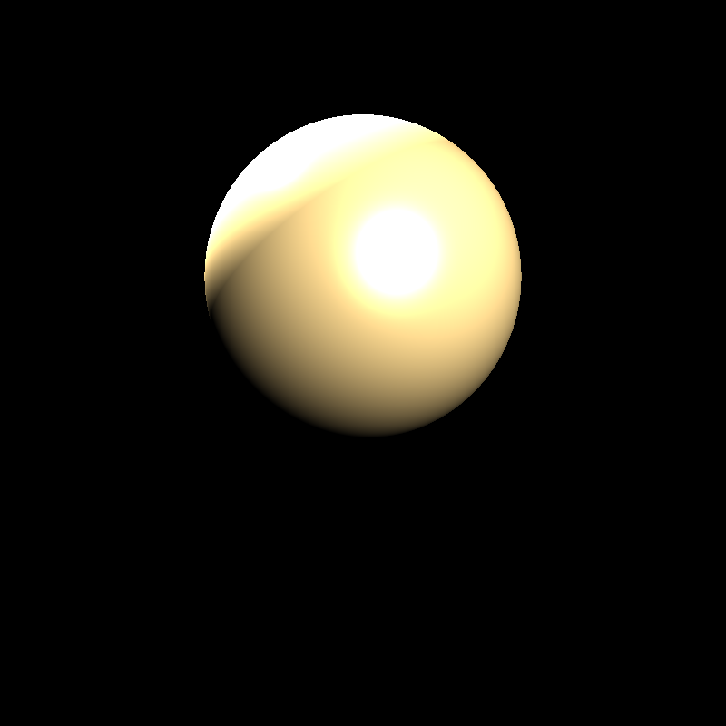

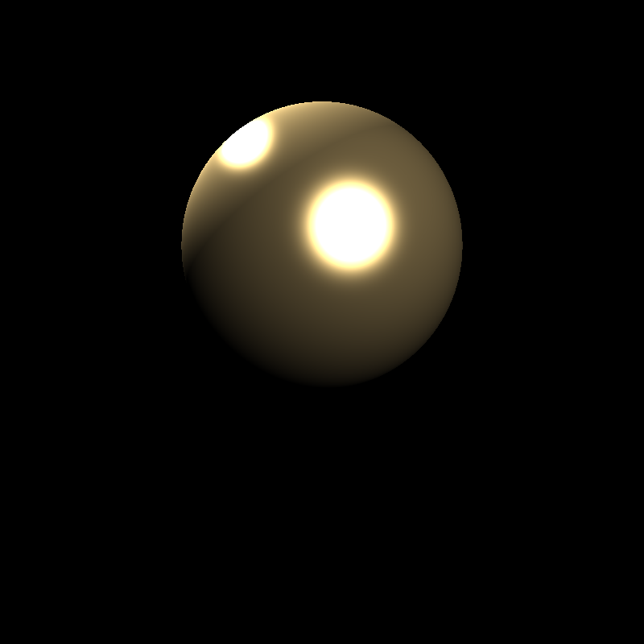

After reading the Torrance-Sparrow part in the `brdf.pdf`, I realized that the $\cos(\phi)$ was not explained in the PDF, which prevented me from implementing it. I asked the instructor about this and waited. However, curiosity got better of me and I skimmed the PBR book. After struggling with the interface (really, just trying to read the PBR book's code is too much for me for some reason), I finally found out that $\cos(\phi)$ was the angle between the normal and $w_o$. A couple of days after I asked, the instructor also replied and my guess was verified, $\cos(\phi)$ is indeed $n \cdot w_o$. After learning this, I implemented Torrance-Sparrow.

```cpp
const auto cos_theta = std::max(0.0f, glm::dot(w_i, n));
if (cos_theta <= 0.0f) {
    return glm::vec3(0.0f);
}

const auto cos_phi = glm::dot(w_o, n);
const auto w_h = glm::normalize(w_i + w_o);
const auto cos_alpha = glm::dot(w_h, n);
const auto D = (exponent + 2.0f) * (1.0f / (2.0f * float(std::numbers::pi))) * std::pow(cos_alpha, exponent);

const auto cos_beta = glm::dot(w_o, w_h);

const auto G =
    std::min(1.0f, std::min((2.0f * cos_alpha * cos_phi) / cos_beta, (2.0f * cos_alpha * cos_theta) / cos_beta));

const auto iota_ratio = (index - 1.0f) / (index + 1.0f);
const auto R_0 = iota_ratio * iota_ratio;

const auto F = R_0 + (1.0f - R_0) * std::pow(1.0f - cos_beta, 5.0f);
const auto F = 1.0f;

return k_d * (1.0f / float(std::numbers::pi)) * (kd_fresnel ? (1.0f - F) : 1.0f) +
       k_s * (D * F * G) / (4.0f * cos_theta * cos_phi);
```

As you can see, it is just the implementation of the formulas in the PDF. However, the result is, well, not good.

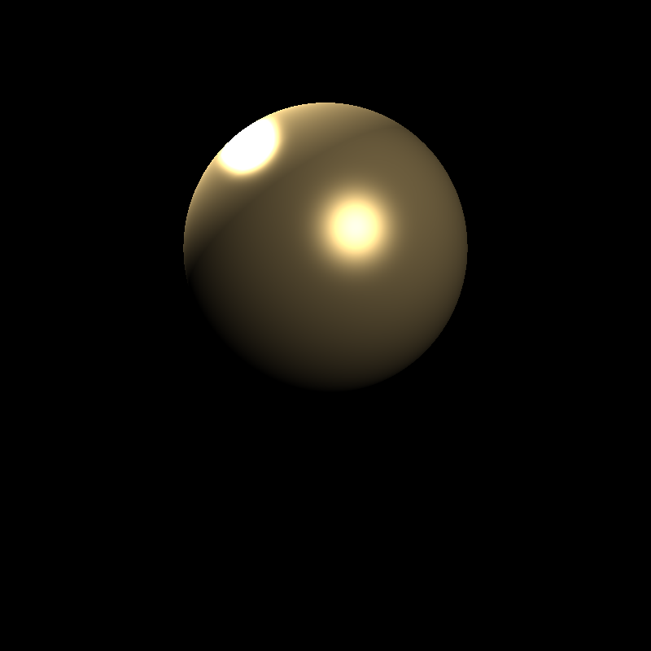

The shines are smaller than the ground truth. This is my first blunder in this homework, Torrance-Sparrow does not work. I actually managed to fix the sphere example by directly using the reflection ratio from the Fresnel calculation in conductors, the result became pretty much pixel-perfect copy of the ground truth, similar to the other sphere examples:


I was happy for a moment, but just a moment. After this, I tested the other BRDF scene, the Killeroo one. The Blinn-Phong one was correct, almost pixel-perfect correct except smooth shading.

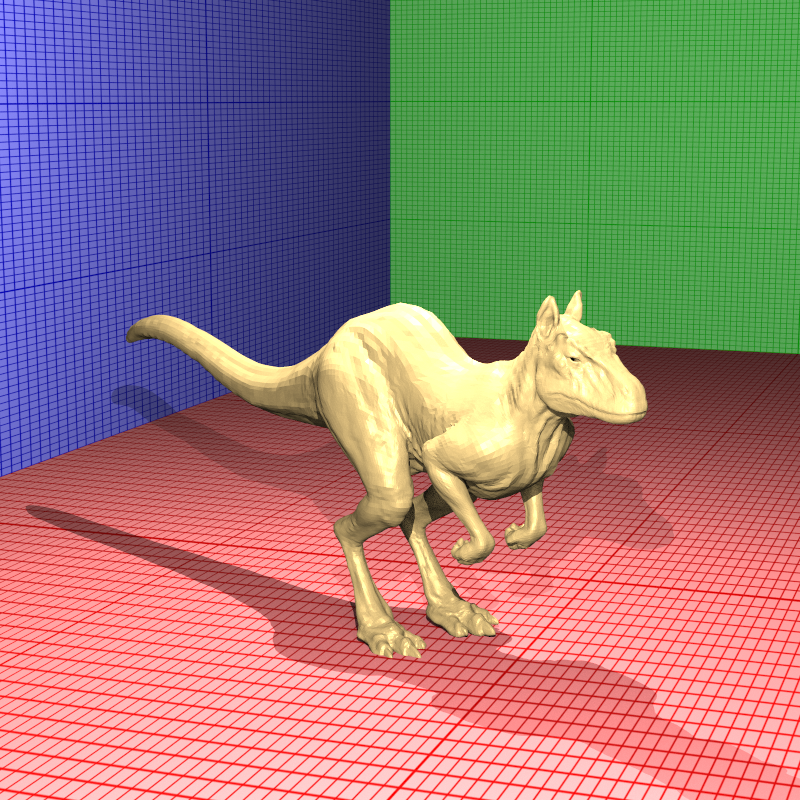


However, the Torrance-Sparrow ones were still not correct.

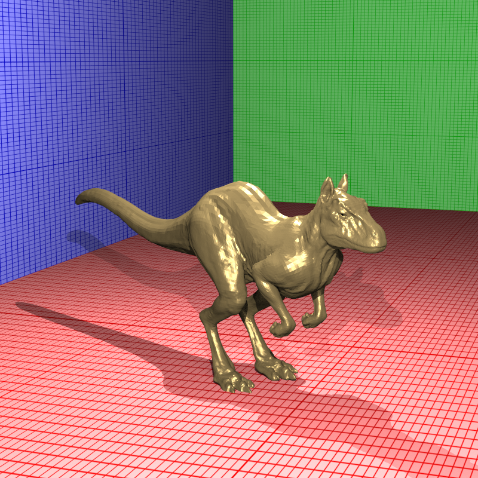

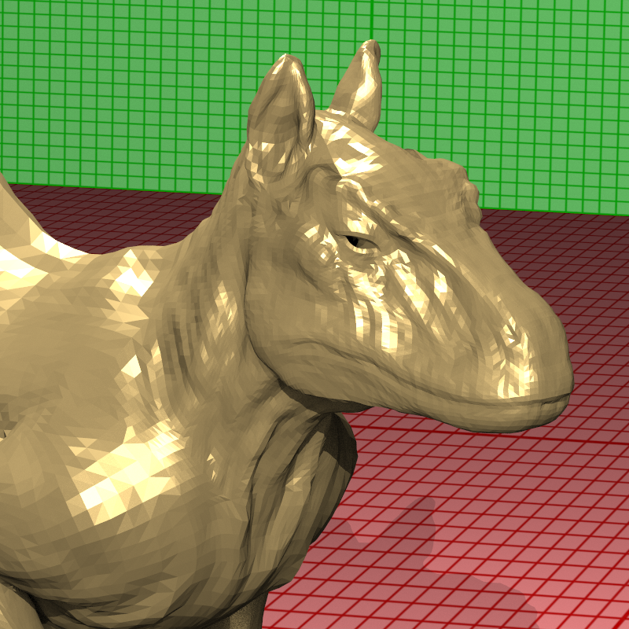

Honestly, after hours and hours of debugging, I have not been able to find the issue. The other parts (like tonemapping) should not be issues since they are exactly the same with the Blinn-Phong one. I debugged the `TorranceSparrow::f` for tens of times, but I could not find the issue, probably since I don't have the correct intermediate values, so I cannot compare them with my intermediate results. I actually realized that the Schlick approximation produced values too low in the sphere example before changing it to the Fresnel one, but I could not find such a thing this time. Lucky for me, the other parts of the homework actually do not require Torrance-Sparrow, they use Blinn/Phong BRDFs.

### Path Tracing

#### Monte Carlo Path Tracing

The $\cos\theta_i$ in the rendering equation is easy to calculate, it is just $n \cdot w_i$. With BRDFs, we also solved the $f(w_o, w_i)$ term inside the integral. The only remaining term is $L(w_i)$. The integral is also a bit wrong, it is biased in this current form. Enter Monte Carlo integration. The backbone of the Monte Carlo integration is the equation

$$
\int f(x)dx = E\left[\frac{1}{N}\sum_{i=1}^N\frac{f(x_i)}{p(x_i)}\right] = E\left[F_N\right]
$$

So we calculate $F_N$, and it will converge to the real value of the integration as we increase the number of samples. For our case, $F_N$ becomes

$$
F_N = \frac{L(w_i) f(w_i,w_o) \cos\theta_i}{p(w_i)}
$$

This $L(w_i)$ is actually not correct in the previous calculations. $w_i$ s were not traced but instead only shadow rays were sent. If something occludes a light source from a point, it actually means that the incoming ray carries the light from that occluded object, unlike our current assumption that a shadowed light contributing zero. Actually, not only the light rays, but any ray in the upper hemisphere of the object (or the full sphere in case of dielectric materials) contributes to the $L(w_o)$. Monte Carlo path tracing is pretty much the implementation of this, we can send random rays and trace them to simulate the integration. Unlike lights, each of which has some unique calculation for $L(w_i)$, these rays get their $L(w_i)$ directly as the result of recursive ray trace. In order to do this, we send additional rays when doing the usual shading (which I have been doing in `IMaterial::simpleShade`) instead of shadow rays to the lights.

```cpp
const auto dir = getRandomDirection(args.n);

const auto w_i = dir;
const auto cos_theta = glm::dot(w_i, args.n);
if (cos_theta <= 0.0f) {
    return glm::vec3();
}

const auto probability = float(2.0f * std::numbers::pi);

const auto f = brdf->f(diffuse_reflectance, specular_reflectance, w_i, w_o, args.n, refraction_index, absorption_index);
const auto L = castRecursiveRay(args, dir);
ray_count += 1;
integration += L * f * cos_theta * probability;
```

Since we are sampling the upper hemisphere uniformly in simple path tracing, we have probability of $\frac{1}{2\pi}$. Since floating point division is pretty slower compared to multiplication, I instead multiply the result with the reciprocal of the probability, which is constant. The `castRecursiveRay` takes 2 arguments here. First one is the arguments of the shading, which includes thing like normal, recursion depth and hit point. The second argument is the direction of the ray, which is uniformly sampled with `getRandomDirection`. Each global illumination ray increases the number of sent rays by 1, so the `ray_count` is increased and the `integration` term of the result is increased by the `F_N`.

If path tracing is enabled (sent through `args`), the function returns this result, if not (so that we only do normal ray tracing as usual), it does not enter here at all, and skip to the usual light calculation part. This branch is actually pretty much free since the branch is either taken by _all_ rays or not taken by _any_ ray, so the branch predictor can predict the result very easily. With this, the path tracing is actually done!

However, since the current lights are not intersectable (actually area and environment lights are intersectable but we can ignore them), nothing can be seen without object lights. Then, let's implement the object lights!

#### Object Lights

Object lights are pretty simple; however, I cheated a bit and instead of parsing `LightMesh` and `LightSphere`s, I changed (by hand) all of them to normal `Mesh` and `Spheres`. An object light is detected whenever I come across `Radiance` field in a mesh or sphere, otherwise the emission value of the mesh/sphere is assigned $(0 0 0)$. This way, I can still detect object lights in the scene (the object lights with $(0 0 0)$ radiance actually breaks this, but can we really consider them as lights if they do not emit at all?) while not changing the parser too much. The parser is a giant function of 500 lines, even after modularization, and mesh parsing code is another beast, so copy-pasting it was not feasible for me unfortunately. Instead, I can just change the test cases, since what I do is simple changes to the names of the tags (and a less-simple change to indices, since `LightMesh`/`LightSphere` elements use a different index scope, so blindly changing the tag usually causes the first meshes in the scene to be overwritten, i.e. deleting some meshes!). And when I did this, the results were, well, let's see:

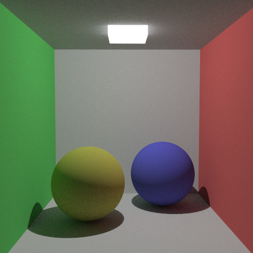

Please ignore that this uses next event estimation (due to the small difference between the orders of implementation and blog post explanation), but the thing I want to show you here is different. As you can see, the shadows are hard! The reason is that the object lights are grouped in a new array, `object_lights` in the `Scene`. These lights actually do not store anything about the mesh or sphere, instead, it stores the bounding box of the object it represents. Bounding box of a sphere is very easy to calculate:

```cpp
return bounding_box_t{
    .start = vertices[sp.center].position - glm::vec3(sp.radius, sp.radius, sp.radius),
    .end = vertices[sp.center].position + glm::vec3(sp.radius, sp.radius, sp.radius),
};
```

and bounding box of the meshes are already calculated for the BVH, the root node is the bounding box of the whole mesh. Thus, bounding boxes can be a way to represent a sampling of object light without discriminating between meshes and spheres. This decreases the efficiency for spheres since sampling a sphere is not that hard, but it removes some code from being written, and I am a lazy person, so I do this. The object light also stores the emission value and the transformation of the bounding box. However, the current `light.point()` implementation had been returning the center of the bounding box, so there was no "sampling" for object lights, resulting in hard shadows. When I implemented the sampling with discrete inversion sampling with the code

```cpp
const auto d = aabb.end - aabb.start;
const auto area_xy = d.x * d.y;
const auto area_yz = d.y * d.z;
const auto area_xz = d.x * d.z;
const auto face_chi = getRandomNumber(0.0f, area_xy + area_yz + area_xz);
auto ret = glm::vec3();
if (face_chi < area_xy) {  // On XY
    const auto x = getRandomNumber(aabb.start.x, aabb.end.x);
    const auto y = getRandomNumber(aabb.start.y, aabb.end.y);
    const auto z = (getRandomNumber() < 0.5f) ? aabb.end.z : aabb.start.z;
    ret = glm::vec3(x, y, z);
} else if (face_chi < area_xy + area_yz) {  // On YZ
    const auto x = (getRandomNumber() < 0.5f) ? aabb.end.x : aabb.start.x;
    const auto y = getRandomNumber(aabb.start.y, aabb.end.y);
    const auto z = getRandomNumber(aabb.start.z, aabb.end.z);
    ret = glm::vec3(x, y, z);
} else {  // On XZ
    const auto x = getRandomNumber(aabb.start.x, aabb.end.x);
    const auto y = (getRandomNumber() < 0.5f) ? aabb.end.y : aabb.start.y;
    const auto z = getRandomNumber(aabb.start.z, aabb.end.z);
    ret = glm::vec3(x, y, z);
}
return glm::vec3(transformation * glm::vec4(ret, 1.0f));
```

and enabled path tracing, the result became this:

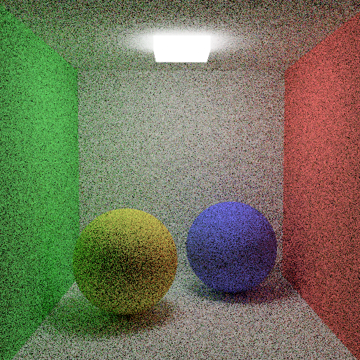

You can see that it is _very_ noisy, but you can also see the effects of the global illumination. The shadow of the left sphere for example has green parts. Success!

#### Importance Sampling

We divide the result of $L(w_i) f(w_i, w_o) \cos\theta_i$ by the probability of $w_i$ to be chosen as you know. For uniform sampling, since an upper unit hemisphere has area of $2\pi$, the probability is the reciprocal of this. However, to decrease the variance, as shown in the lectures, lecture slides and notes, there is a possibility to decrease the variance by converging the division's result to $1$, which has exactly $0$ variance since it is constant. There are various techniques to do that, some of them advanced and some of them simple. In this homework, we need to implement importance sampling and next event estimation. Since I guessed that the next event estimation implementation will be messy (spoiler: it was) I started with importance sampling. Importance sampling is actually very simple to do, we just change the `getRandomDirection` function to get a ray with probabilities based on $\cos\theta_i$ instead of uniform probabilities. For this, inversion sampling must be used, but fortunately, the formulas are given to us in the lecture slides; hence, I just implemented them.

```cpp
constexpr auto PI = float(std::numbers::pi);
glm::vec3 u, v;
get_uv(n, u, v);

const auto chi = glm::vec2(getRandomNumber(), getRandomNumber());
const auto sqrt_chi_2 = std::sqrt(chi[1]);
const auto sqrt_1_chi_2 = std::sqrt(1.0f - chi[1]);
const auto ret = u * sqrt_chi_2 * std::cos(2.0f * PI * chi[0]) + v * sqrt_chi_2 * std::sin(2.0f * PI * chi[0]) +
            n * sqrt_1_chi_2;
return glm::normalize(ret);
```

This code returns a new sampled direction, with higher probabilities for rays around the normal and less for rays parallel to the surface. Then, the `probability` we need to multiply becomes different, it will be $\frac{\cos\theta_i}{\pi}$. This is a pretty nice improvement to the $F_N$, since if we put this as $p(w_i)$, we get $\frac{L(w_i) f(w_i, w_o)}{\pi}$ as the inner term. We just removed the variance caused by the $\cos\theta_i$! After doing this decision based on whether importance sampling is enabled or not, we can render the scene again after enabling it for the scene.

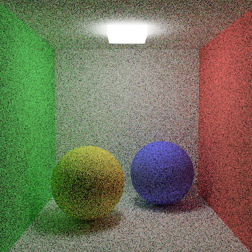

The noise actually did not change that much, since the contribution of the geometry and light distribution of the scene to the variance is probably much higher compared to $\cos\theta_i$, but there are a bit improvement. The running time also did not change in a statistically significant way, which is nice, since this means this improvement is free, and free vinegar is sweeter than honey.

#### Russian Roulette

> Russian roulette is a dangerous game for humans and rays alike.
>
> Ahmet Oğuz Akyüz, 2025 (?)

If I would order the path tracing parts' implementation based on difficulty, I would put Russian Roulette to the middle. Normal path tracing and importance sampling were easy, and my guess for next event estimation was that it would be hard. So, I started to implement Russian Roulette.

For Russian Roulette, we need to pass the throughtput of the rays, which I did with the `args` param. For reference, this is the definition of its type, `shading_arguments`:

```cpp
struct shading_arguments {
    const Scene& s;
    glm::vec3 camera_pos;
    glm::vec3 hit_point;
    glm::vec3 n;
    glm::vec3 ray_dir;
    int recursion_depth;
    float ray_time;
    glm::ivec2 sample_pos;
    glm::ivec2 sample_size;
    glm::vec2 uv;
    const Textures& textures;
    float lambda;
    glm::vec3 emission;
    PathTracingInfo path_tracing_info;
    float throughtput;
    bool ignore_object_lights;
    int splitting_factor;
};
```

I put the path tracing info (four `bool`s, each denoting whether a feature is enabled or not) in a different structure, yet it was still huge. This is pretty much a summarized history of my ray tracer homwork chain adventure, and I am very disappointed with myself due to its lack of flexibility.

Oh, let's return to the main topic, Russian Roulette. As you can see, there is `throughtput` in the `args`. For every ray, it is assigned to `q * args.throughtput`. The first term is calculated as `maxOfVector(f * cos_theta * probability)`, where `maxOfVector` gets the maximum element from a `glm::vec3`. If `q` is `0`, the code returns the current result, which is usually only the emission since `q == 0` mostly means that the object does not reflect any light. If the `recursion_depth` is more than the minimum depth defined in the scene and if a random number in $[0,1)$ is bigger than `q` (whose possibility is $1-q$), the ray is terminated and the function returns black. Otherwise, the `q` is multiplied by the throughtput of the previous rays and this cumulative throughtput is sent to the next ray. As explained in the lectures and lecture slides, this approach does not decrease variance at all, but instead removes the bias caused by the recursion depth while improving the performance, since in a closed space, every ray would bounce at maximum depth due to global illumination rays, which is bad for performance.

In order to not introduce bias, we need to multiply the contribution of the ray with $\frac{1}{q}$, since its probability to live is $q$. The result? Well, the noise is not reduced and the scene looks a bit different for some reason (probably the path tracer having a hidden bias I could not find), but the performance improved by \~$30.5\%$, which is great!


So, the only remaining feature is next event estimation! Ikimashou!

#### Next Event Estimation

Next event estimation is a way to reduce the noise of the path traced images by sampling the lights directly. I am not sure, but I think this reduces the variance by tying some of the probability to $L(w_i)$, since the rays directly coming from a light usually have higher $L(w_i)$, and next event estimation directly samples these rays, pretty much giving $1$ probability to those rays. The downside is probably that it is _very_ easy to introduce bias, and I think I fell to this pitfall and do not know how exactly to get out of it.

Next event estimation is pretty much the hardest part of the path tracing. Actually, it is still not that hard compared to others, since the actual skeleton of next event estimation has been written so far. It would actually be harder if we did not apply the _0/1 heuristic_ and sent shadow rays to every light in the scene, since randomly choosing a light to sample would mean more code. Fortunately, _0/1 heuristic_ saves the day and we can actually use the normal ray tracing code. The only modification I did for light loops was actually just increasing the `ray_counter` if the shadow ray hits the light. The other modification to the shading code was checking whether

1. The ray that intersected with this object was a global illumination ray (not a reflection or refraction ray) and
2. Next event estimation is active and
3. The ray is not a primary ray

If this is true, this ray should be discarded, i.e. directly returns black. The last one was returning the current integration if next event estimation is _not_ enabled, and if so, continueing the code.

The most difficult part was changing the `castShadowRay`. It now takes 6 arguments instead of 3. The first three were

1. Shading arguments (similar to `castRecursiveRay`)
2. Target point, sampled on the light
3. Check distance flag, due to directional and environment lights.

The new three are enabled with the fourth argument, `is_intersectable`. It can take a bounding box, which is used to detect whether we hit the light object or an occluder. The `Scene::rayCast` returns the light object even if there is no occluder, so I needed this change. The last thing it takes is the normal of the intersection point, which is used to zero out the incoming light if the object is hit from a backface. However, this is a bit janky.

Next event estimation was somewhat easier than my expectation, but it was still hard. The problem is, this does not work well. I think there is some bias remaining in the code here and there, which results in different images. However, I think the results are not bad looking at all, they are good, and they are fast.


There is not too much of a noise, and global illumination is easily seen! Wonderful!

Let's try glass scene, which should be a bit hard with next event estimation due to caustics, but it looks like there is not that much of an issue.


As you can see, they are pretty much the same image, but the next event estimated one is rendered in a quarter of time of the latter! I guess I did not have a problem with caustics since the reflection and refraction rays always send recursive rays with `ignore_object_lights == false`, which means that the rays coming out of the dielectric material _can_ intersect with the object lights, whereas global illumination rays return black when they intersect. I actually did this a bit accidentally since I put `false` as the default value of `ignore_object_lights` just because I was lazy to change the other `castRecursiveRay` calls. Laziness actually caused a benefit!

#### Splitting

Splitting was a bit surprise for me. Since it is only mentioned in the Hints and Tips section of the homework PDF, I did not implement them, but when my friend asked about them and said that we need to implement splitting, I was surprised and asked the instructor whether it is mandatory or not, with the answer being affirmative. However, as he said, this was very, very easy to implement. I just put the global illumination ray part into a loop, ran this loop for `SplittingFactor` times _if and only if the ray is primary_, and was done. Default value of `SplittingFactor` was 1, which means the absence of it. However, it looks like I have some problems with the path tracer, since the results are quite a bit different depending on the splitting factor. The first number is sample count and the second number is splitting factor:


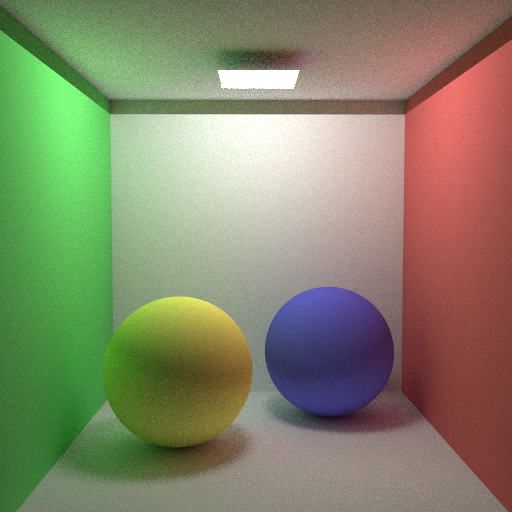


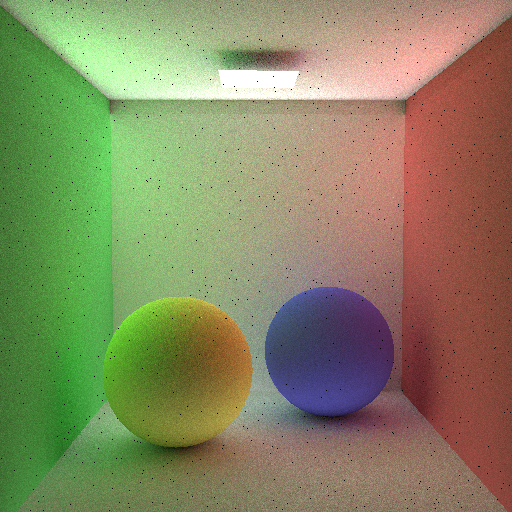

As you can see, the global illumination becomes stronger as the splitting factor increases. This is probably caused by the fact that we send more global illumination rays as splitting factor grows; however, this should not increase their contribution since they should have been divided by the number of rays so that the _average_ of the contribution should be reflected to the result. I implemented this in hurry, so I did not test it too well.

In both glass and splitting, you can see some darker strips in the upper parts of the walls, and a strong shadow on top of the light object. I thought about how to solve this difference, but could not come with a solution. Using backface culling for shadow rays _if it is for an object light_ did not work for some reason. I also multiplied the coming irradiance with the cosine of the angle between the incoming ray and the normal of the light object, but it also did not fix this and it even created more artifacts like bright strips in line with the edges of the light object. However, I think that my result is not bad, since such a 2D light should cause such sharp corners, at least in my opinion.

## Results

Finally, the results! I actually tried Russian Roulette in glass, but it constantly gave stack overflow if I used the transmission and reflection factors calculated using Fresnel formulas. After some fiddling with code, I managed to prevent the stack overflow, but the result became this:


It seems like there is no refraction, or probably a broken one.

I also tried Veach Ajar, and the result was, uhh, not bad. It is definitely not as good as the reference image, but it at least looks nice enough. I created a GIF again, with 100, 256 and 1600 samples. The original case actually uses 2500 samples, but it would take so long that even if I started it right before sleeping, it would not be finished when I wake up. 1600 was a nice number that it is high enough to occupy my computer in the whole night while being low enough to make the rendering done in my sleep time.

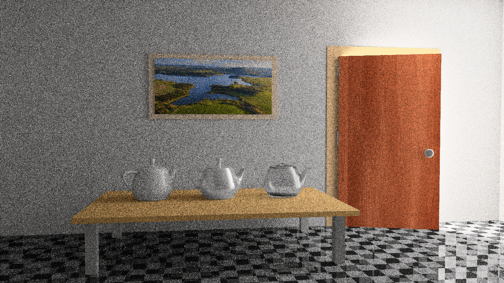

This is actually cannot be reproduced by my submission. Since this takes so long to render, I rendered them before some changes. I rendered the scene with 16 samples after being done, and the result is pretty worse:


As you can see, it is a bit brighter compared to the GIF. However, I also feel like that this brightening may have been caused by lack of samples instead, so a 100 sample render would produce more-or-less the same result as the one in the GIF, yet I cannot test this hypothesis as I do not have time. If I had, I would use it to render Sponza.

As I mentioned Sponza, let's have a look at it, too.


I tested the path tracing with 1 sample and 16 samples. By extrapolation, 100 sample one (the original) would take about 1 hour; however, I don't think it is worth, since the scene is so wrong, as you can see.

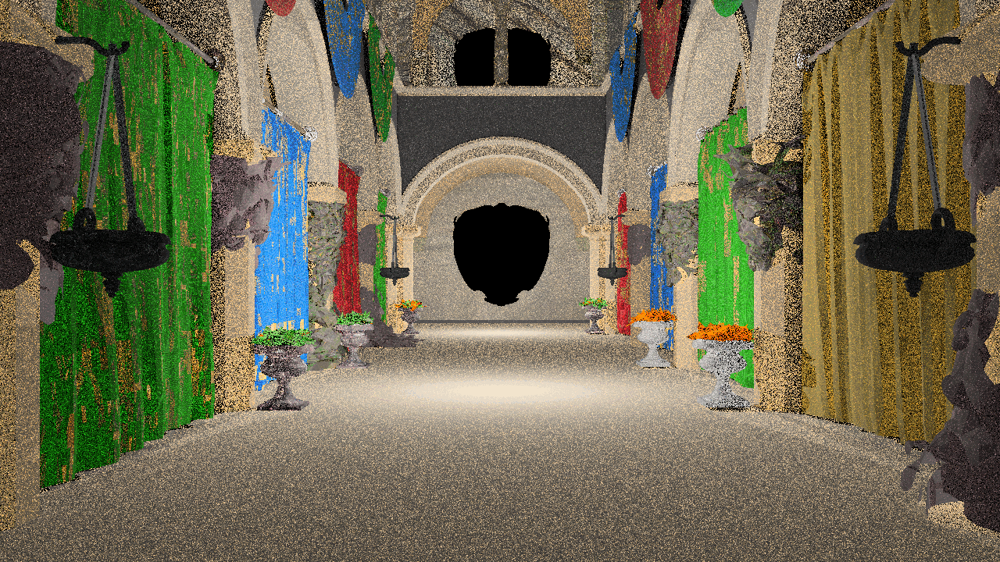

The scene is pretty wrong, but mostly this is caused by the textures instead of path tracing. The overall brightness of the scene is similar to the ground truth image, but the textures are missing. I am not surprised since I needed to fix the textures by hand, since my current code does not support holes in textures. I implemented hole fix in meshes but implementing it is a bit cumbersome, so I did not do it for other parts. Yet the geometry looks correct, so I think my binary file parser works as expected.

I also sense a bit of problem in color bleeding around the blinds on sides, like the green blind does not affect the ground as much as I expected.

I also tested ellipsoid object lights, and the results are a bit more noisy compared to the ground truth image and the shadows look a bit smaller. However, it looks pretty much correct to my eyes if I do not compare it to the ground image.


And here are a couple of more results:


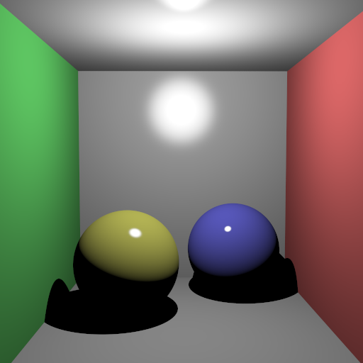

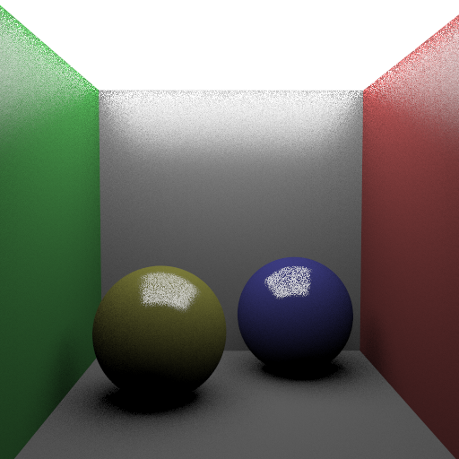

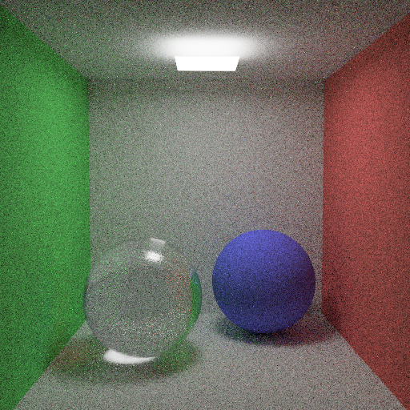


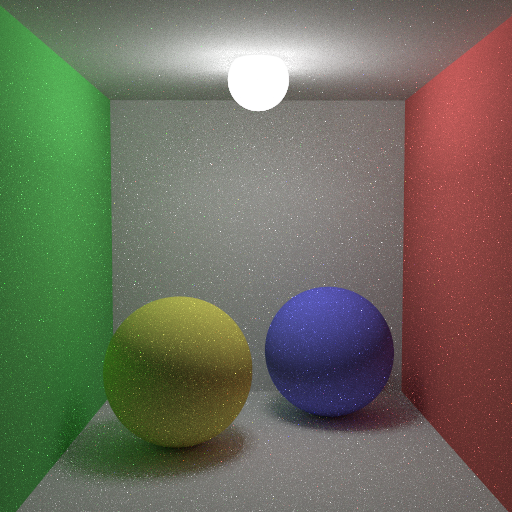


## Performance

Here are some performance measurements. This time, I divided the cases into a few groups. Unfortunately, due to the fact that the renders take so much time, I only did measurements once, compared to my usual way to calculate the times as the geometric mean of 10 measurements.

The first group is Veach Ajar, with increasing sample counts. I also calculated seconds per sample in the render time cells.

| Testcase                      | Init Time | Render Time                             |
| ----------------------------- | --------- | --------------------------------------- |
| VeachAjar_path (16 samples)   | 0.85864   | 252.9 (\~4.2min) (15.81 seconds/sample) |
| VeachAjar_path (100 samples)  | 0.85864   | 1416  (\~23min)  (14.16 seconds/sample) |
| VeachAjar_path (256 samples)  | 0.85864   | 4007  (\~67min)  (15.65 seconds/sample) |
| VeachAjar_path (1600 samples) | 0.85864   | 22558 (\~6.2h)   (14.1 seconds/sample)  |

Here is the graph for render time and sample count:


And here is the graph for render time per sample and sample count:


Similar to Veach Ajar, here are measurements for Sponza:

| Testcase                 | Init Time | Render Time                    |
| ------------------------ | --------- | ------------------------------ |
| Sponza_path (1 sample)   | 1.2111    | 38.187 (38.187 seconds/sample) |
| Sponza_path (16 samples) | 1.2111    | 607.4 (37.9625 seconds/sample) |

I also measured the performance impact of splitting. As you can see, it improves the performance, but the biggest change happens while going from 1 to 4 splits, so the performance improvement diminishes as we split more.

| Testcase                     | Init Time | Render Time |
| ---------------------------- | --------- | ----------- |
| flat_importance_next (100x1) | 0.014106  | 20.335      |
| flat_importance_next (25x4)  | 0.014106  | 17.048      |
| flat_importance_next (4x25)  | 0.014106  | 16.397      |
| flat_importance_next (1x100) | 0.014106  | 16.101      |

Here is graph for render time by split count:


As you can see, it looks pretty similar to the graph of $\frac{1}{x}$.

Here are the render times of BRDF testcases:

| Testcase                            | Init Time | Render Time |
| ----------------------------------- | --------- | ----------- |
| brdf_blinnphong_modified_normalized | 0.011135  | 0.034885    |
| brdf_blinnphong_modified            | 0.010156  | 0.033492    |
| brdf_blinnphong_original            | 0.0099911 | 0.030343    |
| brdf_phong_modified_normalized      | 0.010251  | 0.034505    |
| brdf_phong_modified                 | 0.019106  | 0.035593    |
| brdf_phong_original                 | 0.010284  | 0.030646    |
| brdf_torrancesparrow                | 0.011338  | 0.037017    |
| killeroo_blinnphong                 | 0.50651   | 5.4679      |
| killeroo_blinnphong_closeup         | 0.50651   | 7.6774      |
| killeroo_torrancesparrow            | 0.51657   | 5.4071      |
| killeroo_torrancesparrow_closeup    | 0.51657   | 7.8329      |

And the graphs:

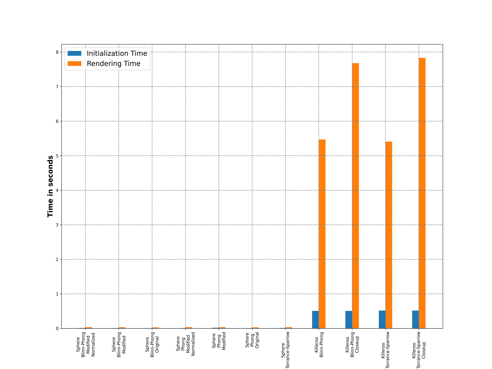


And here are the measurements for direct lighting and path tracing testcases. I also normalized the 400 sample cases to 100 cases by dividing the time by 4 in order to improve the scale of the graph.

| Testcase                         | Init Time | Render Time | Render Time (normalized to 100 samples) |
| -------------------------------- | --------- | ----------- | --------------------------------------- |
| cornellbox_jaroslav_diffuse      | 0.0008561 | 3.5037      | 3.5037                                  |
| cornellbox_jaroslav_diffuse_area | 0.0008162 | 3.6002      | 3.6002                                  |
| cornellbox_jaroslav_glossy       | 0.0008227 | 3.3282      | 3.3282                                  |
| cornellbox_jaroslav_glossy_area  | 0.011007  | 3.5994      | 3.5994                                  |
| flat_importance (400 samples)    | 0.012726  | 41.97       | 10.4925                                 |
| flat_importance_next             | 0.012726  | 20.282      | 20.282                                  |
| flat_importance_next_russian     | 0.012726  | 14.98       | 14.98                                   |
| flat_next                        | 0.012726  | 19.692      | 19.692                                  |
| glass (400 samples)              | 0.012292  | 208.52      | 52.13                                   |
| glass_importance (400 samples)   | 0.012292  | 149.63      | 37.4075                                 |
| glass_next                       | 0.012292  | 51.278      | 51.278                                  |
| glass_next_importance            | 0.012292  | 57.509      | 57.509                                  |
| glass_next_importance_russian    | 0.012292  | 35.983      | 35.983                                  |
| prism                            | 0.0014494 | 13.467      | 13.467                                  |
| prism_importance                 | 0.0014494 | 13.466      | 13.466                                  |
| prism_next                       | 0.0014494 | 28.38       | 28.38                                   |
| prism_next_importance            | 0.0014494 | 27.572      | 27.572                                  |
| prism_next_importance_russian    | 0.0014494 | 21.735      | 21.735                                  |
| prism_next_russian               | 0.0014494 | 19.506      | 19.506                                  |
| prism_russian                    | 0.0014494 | 9.7997      | 9.7997                                  |
| sphere_importance (400 samples)  | 0.012391  | 41.66       | 10.415                                  |
| sphere_importance_next           | 0.012391  | 20.294      | 20.294                                  |
| sphere_importance_next_russian   | 0.012391  | 15.212      | 15.212                                  |
| sphere_next                      | 0.012391  | 19.94       | 19.94                                   |

And of course, the graphs for these measurements:

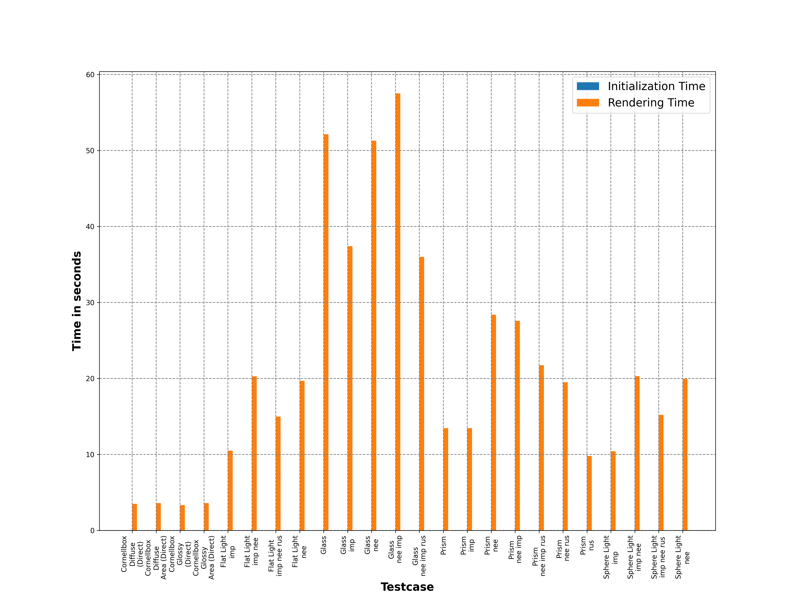


## Conclusion

I am actually surprised that I am one of the only ones that tried Veach Ajar. It is, in my opinion, much easier to try since it does not have any differences compared to my parsing assumptions, the XML definitions are better than Sponza, yet there are people rendering Sponza but not Veach Ajar.

/rant

I also want to say that I really did not like the input format. Not because it is XML, but because how it feels so ad-hoc. I guess this is due to the exports, since exporting a scene defined with PLY files needs those PLY files, similar to this new binary file thing.

The index system was also a great deal of headache for me. I implemented the index system for meshes in order to support instances, but I really struggled to do it. However, I think this may be a mix of a bit of obsession and a bit of skill issue. Since the ray cast function is the backbone of the whole ray/path tracer, I wanted to make it as fast as possible by putting all meshes in a vector to make them consecutive. I **really** need to implement a nice open-addressing hash table in C++ for these purposes. If I had such a data structure, iterating over meshes/spheres/triangles would still be consecutive (albeit with possible holes that need to be skipped), but this data structure would easily support those holes without extra work. Unfortunately, `std::unordered_map` uses closed-addressing (so the values are stored in separate linked lists instead of on-place) due to some implications in the standard and `std::map` uses red-black trees to support ordering property required for the `std::map`.

/unrant

Oh, I really said it! Sorry for venting about the homework, but I needed to say them. I would like to fix some of them, like the vertex format (merging XML, PLY and binary) if I can. I did not have time for implementing any format conversion in the term, but the semester holiday may be enough to make it happen.

As I said in the introduction, I am sad and angry that I underestimated the homework, resulting in this mess. If only I worked on this one harder, maybe even a couple of days would remain that I could use for the final project, which neither I nor my teammate have started yet. The next two days will probably be pretty intense, I suppose.

Between the messy codebase and non-exact requirements, I really felt that I am doing some software engineering work in this homework. I want to thank the instructor for this great chain of homeworks. See you in the blog post for the final project!

[^1]: This time it is not an anime reference, but a history/Sabaton reference! Actually, the phrase "[the war to end war](https://en.wikipedia.org/wiki/The_war_to_end_war)" was used for the first world war (back then also known as the Great War) in the interwar period, since the sheer size of the war made many Westerners think that the taming or destroying the Germans in that war would bring a great peace. However, as we know now, not only that the WW1 was not the last war, but it even caused the even more devastating second world war. The phrase "the war to end all wars" is an alternative phrase with more-or-less the same meaning, while the phrase "the end of the war to end all wars" is the name of a [Sabaton song](https://www.youtube.com/watch?v=8um0s-h3_AM), referencing this phrase. The song is about the overall WW1, the armistice and of course the irreversible results of the war like the devastation or the fact that four biggest non-national empires (German, Austro-Hungarian, Ottoman and Russian) being dissolved. I also remember the song each time the Armistice of Versailles is mentioned, since the outro of the song starts with "November 11th settling the score", referencing the date of the armistice.

---
{
    "author": "Erencan Ceyhan",
    "lang": "en",
    "tags": ["C++", "Programlama", "Teknoloji", "Gönderi", "Ödev", "Işın İzleme"]
}
---

---
{
   "date": "[2025](/gönderiler/2025)-[01](/gönderiler/2025/01)-21 21:50:15+03:00"
}
---

